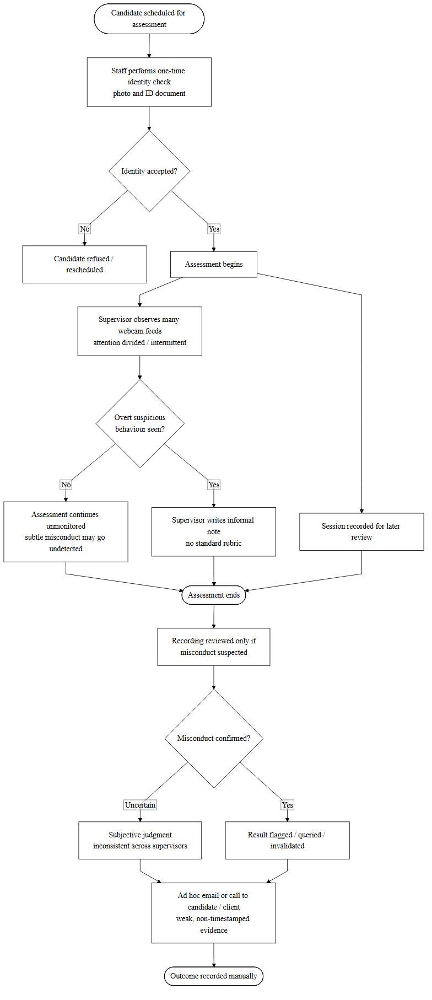
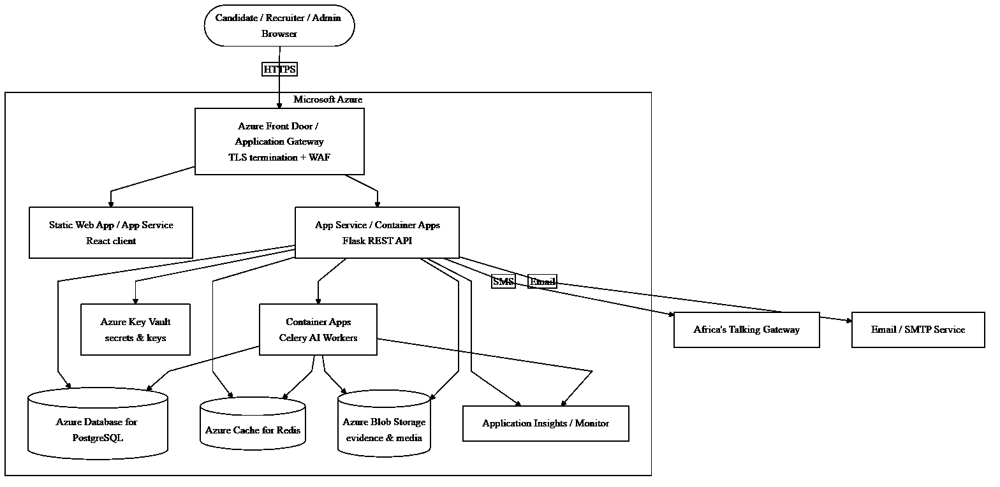

<!--
SemanticGuard AI — Final Year Project Book (Full Thesis)
Structured strictly after the reference template "Final BOOK (Updated).pdf"
(Adventist University of Central Africa final-year project format), with entirely
original content for the SemanticGuard AI project (Case Study: Semantic Services Rwanda Ltd).

FORMATTING GUIDE (applied on conversion to Word/PDF):
  Font: Times New Roman, 12 pt, black only.
  Line spacing: 1.5. Body alignment: justified. Margins: 1 in (1.25 in left for binding).
  Heading 1 (Chapter titles): 16 pt, centered, ALL CAPS, bold.
  Heading 2 (Major headings):  14 pt, centered/left, Title Case, bold.
  Heading 3 (Sub-headings):    12 pt, left, Title Case, bold.
  Figure/Table captions: centered, sequentially numbered.
  Preliminary pages: lower-case roman numerals. Body pages: arabic numerals.
  Every major section and every chapter starts on a new page.
-->

# ADVENTIST UNIVERSITY OF CENTRAL AFRICA

&nbsp;

# SEMANTICGUARD AI: AN AI-POWERED CANDIDATE ASSESSMENT INTEGRITY AND FRAUD DETECTION SYSTEM

**Case Study: Semantic Services Rwanda Ltd**

&nbsp;

A Final Year Project

Presented in partial fulfillment of the

Requirements for the degree of

**BACHELOR OF SCIENCE IN INFORMATION TECHNOLOGY**

Major in

**SOFTWARE ENGINEERING**

&nbsp;

By

**SHINGIRO Faisal**

June 2026

# DECLARATION

I, **SHINGIRO Faisal**, Student ID Number …………, a student at the Adventist University of Central Africa in the Faculty of Information Technology, Department of Software Engineering, declare that this research project entitled *"SemanticGuard AI: An AI-Powered Candidate Assessment Integrity and Fraud Detection System"* is my own original work. I prepared it myself based on my own knowledge, study, and practical experience. This work has never been submitted to any university or college before, either in part or in full, for the award of any academic qualification. All sources of information consulted during this study have been duly acknowledged in the text and in the list of references.

Signature: …………………………………

Date: ………/……………/………………..

# APPROVAL

I, …………………………………, hereby certify that the student **SHINGIRO Faisal**, in the Faculty of Information Technology, Department of Software Engineering, has completed this Final Year Project report entitled *"SemanticGuard AI: An AI-Powered Candidate Assessment Integrity and Fraud Detection System"* under my supervision, and that it is hereby submitted with my approval as meeting the requirements for the partial fulfillment of the award of a Bachelor of Science in Information Technology.

Supervisor's Name: …………………………………

Supervisor's Signature: …………………………………

Date: …………………………………………………...

# DEDICATION

To Almighty God, the source of all wisdom, knowledge, and understanding.

To my beloved parents, whose patience, prayers, and sacrifices have carried me through every stage of this journey.

To my dear sisters and brothers, classmates, friends, and relatives.

To my supervisor, for the guidance and encouragement that shaped this work.

And to every honest candidate who deserves an assessment process that rewards genuine effort and integrity,

I dedicate this final report.

# ACKNOWLEDGEMENTS

I would like to express my sincere gratitude to Almighty God for His guidance, protection, and the strength He granted me throughout my academic journey. His grace enabled me to successfully complete this study.

I extend my heartfelt appreciation to the administration of the Adventist University of Central Africa (AUCA) for providing a supportive academic environment and a well-structured programme that has greatly contributed to my intellectual and professional growth.

I am deeply grateful to my parents for their unwavering moral, spiritual, and financial support, and for the encouragement they offered me during the most demanding moments of this work.

My sincere thanks go to the academic staff of the Department of Software Engineering for their dedication and commitment to student success. In particular, I wish to express my profound appreciation to my supervisor, …………………………………, for the invaluable guidance, constructive feedback, and professional mentorship offered throughout the development of this project.

I also wish to acknowledge the management and staff of **Semantic Services Rwanda Ltd**, together with its parent organization, **tfSemanticServices GmbH (Germany)**, for granting me permission to conduct this study within their recruitment and assessment context, and for their cooperation during requirements gathering and validation.

Finally, I extend my appreciation to my classmates and friends for their cooperation, teamwork, and shared learning, and to everyone who contributed, directly or indirectly, to the successful completion of this work. May God bless you all abundantly.

SHINGIRO Faisal

# ABSTRACT

**TITLE:** SemanticGuard AI: An AI-Powered Candidate Assessment Integrity and Fraud Detection System

**Name of Researcher:** SHINGIRO Faisal

**Faculty Advisor:** …………………………………

**Date Completed:** June 2026

The migration of recruitment assessment from supervised, physical examination centres to remote and computer-based settings has advanced faster than the capacity of traditional human proctoring to safeguard it. At Semantic Services Rwanda Ltd, a technology-driven recruitment and candidate-assessment organization, online competence tests are increasingly used to screen large numbers of applicants. However, a single human supervisor cannot reliably observe many candidates simultaneously, nor detect the brief and subtle behaviours — a glance at a concealed phone, a moment of off-screen attention, or the silent opening of another browser tab — through which assessment fraud commonly occurs. This has created substantial challenges, including undetected impersonation and collusion, inconsistent and subjective judgments of suspicious behaviour, weak and non-defensible evidence, delayed intervention, and an erosion of trust in the fairness of selection outcomes.

This project designed and developed **SemanticGuard AI**, an intelligent, web-based assessment integrity platform that consolidates five complementary artificial-intelligence monitoring modules — continuous face recognition and identity verification, mobile-phone and object detection, eye-gaze tracking, head-pose estimation, and browser-activity monitoring — and fuses their outputs through a weighted risk-scoring engine into a single, transparent integrity risk score (0–100) for each candidate. The platform was implemented as a multi-role web application, with the user interface developed in **React** and **TypeScript**, a backend built on **Flask (Python)** that exposes a secure REST application programming interface, and **PostgreSQL** for relational data storage. Security was enforced through JSON Web Token authentication, role-based access control, multi-factor authentication, encryption, and comprehensive audit logging, while a proportionate, multi-channel notification subsystem delivers in-dashboard alerts, email, and SMS through the Africa's Talking gateway so that recruiters are reached promptly even when away from the monitoring console.

The system was developed following the **Agile (Scrum)** methodology over an iterative, multi-phase plan, and validated through a layered testing strategy comprising unit, integration, system, performance, and security testing, complemented by quantitative evaluation of the artificial-intelligence modules using Precision, Recall, F1-score, and confusion matrices, and by user acceptance testing with stakeholders from Semantic Services Rwanda Ltd. The resulting platform increases the proportion of fraudulent behaviour that is detected, reduces the manual burden on evaluators, delivers real-time alerts for timely intervention, and produces detailed, timestamped evidence and audit reports suitable for formal hiring-integrity reviews. By combining multi-signal detection with transparency, proportionality, and a human-in-the-loop design that augments rather than replaces human judgment, SemanticGuard AI offers an accurate, affordable, and trustworthy means of protecting the integrity and fairness of online recruitment assessment.

**Keywords:** assessment integrity, online proctoring, computer vision, face recognition, object detection, gaze tracking, risk scoring, fraud detection, recruitment technology.

# TABLE OF CONTENTS

DECLARATION ............................................................................................. i

APPROVAL ................................................................................................. ii

DEDICATION ............................................................................................. iii

ACKNOWLEDGEMENTS ....................................................................................... iv

ABSTRACT ................................................................................................. v

TABLE OF CONTENTS ...................................................................................... vi

LIST OF TABLES ........................................................................................ viii

LIST OF FIGURES ........................................................................................ ix

LIST OF ACRONYMS AND ABBREVIATIONS ...................................................................... x

**CHAPTER ONE: GENERAL INTRODUCTION** ...................................................................... 1

1.1 Introduction

1.2 Background of the Study

1.3 Statement of the Problem

1.4 Choice and Motivation

1.5 Objectives of the Study

&nbsp;&nbsp;&nbsp;&nbsp;1.5.1 General Objective

&nbsp;&nbsp;&nbsp;&nbsp;1.5.2 Specific Objectives

1.6 Scope of the Project

1.7 Methodology and Techniques

&nbsp;&nbsp;&nbsp;&nbsp;1.7.1 Documentation

&nbsp;&nbsp;&nbsp;&nbsp;1.7.2 Interview Questions and Responses

&nbsp;&nbsp;&nbsp;&nbsp;1.7.3 Observation

1.8 Expected Results

1.9 Organization of Work

**CHAPTER TWO: ANALYSIS OF THE CURRENT SYSTEM** ............................................................. 12

2.1 Introduction

2.2 Description of the Current System Environment

&nbsp;&nbsp;&nbsp;&nbsp;2.2.1 Historical Background

&nbsp;&nbsp;&nbsp;&nbsp;2.2.2 Vision

&nbsp;&nbsp;&nbsp;&nbsp;2.2.3 Mission

2.3 Description of the Current System

2.4 Analysis of the Current System

2.5 Modeling of the Current System

2.6 Problems of the Current System

2.7 Proposed Solution

2.8 System Requirements

&nbsp;&nbsp;&nbsp;&nbsp;2.8.1 Functional Requirements

&nbsp;&nbsp;&nbsp;&nbsp;2.8.2 Non-Functional Requirements

**CHAPTER THREE: REQUIREMENTS ANALYSIS AND DESIGN OF THE NEW SYSTEM** ........................... 24

3.1 Introduction

3.2 Unified Modeling Language (UML)

3.3 Design of the New System – Diagrams

&nbsp;&nbsp;&nbsp;&nbsp;3.3.1 Use-Case Diagram

&nbsp;&nbsp;&nbsp;&nbsp;3.3.2 Class Diagram

&nbsp;&nbsp;&nbsp;&nbsp;3.3.3 Sequence Diagram

&nbsp;&nbsp;&nbsp;&nbsp;3.3.4 Activity Diagram

3.4 Database Diagram (Entity–Relationship Diagram)

3.5 Data Dictionary

3.6 System Architecture Design

**CHAPTER FOUR: IMPLEMENTATION OF THE NEW SYSTEM** ........................................................ 40

4.1 Introduction

4.2 Technologies Used

&nbsp;&nbsp;&nbsp;&nbsp;4.2.1 Front End

&nbsp;&nbsp;&nbsp;&nbsp;4.2.2 Back End

&nbsp;&nbsp;&nbsp;&nbsp;4.2.3 Artificial Intelligence and Computer Vision

4.3 Presentation of the New System

4.4 Software Testing

&nbsp;&nbsp;&nbsp;&nbsp;4.4.1 Unit Testing

&nbsp;&nbsp;&nbsp;&nbsp;4.4.2 Integration Testing

&nbsp;&nbsp;&nbsp;&nbsp;4.4.3 System Testing

&nbsp;&nbsp;&nbsp;&nbsp;4.4.4 Performance Testing

&nbsp;&nbsp;&nbsp;&nbsp;4.4.5 Security Testing

&nbsp;&nbsp;&nbsp;&nbsp;4.4.6 Validation of AI Results

4.5 Hardware and Software Requirements

4.6 Deployment Architecture

**CHAPTER FIVE: CONCLUSIONS AND RECOMMENDATIONS** .................................................. 56

5.1 Conclusions

5.2 Recommendations

**REFERENCES** ............................................................................................................. 60

**APPENDICES** ............................................................................................................. 63

&nbsp;&nbsp;&nbsp;&nbsp;Appendix A: Curriculum Vitae

&nbsp;&nbsp;&nbsp;&nbsp;Appendix B: Data Collection Letter

&nbsp;&nbsp;&nbsp;&nbsp;Appendix C: Approval Letter from Organization

# LIST OF TABLES

Table 1: Specific Objectives and Corresponding Detection Modules

Table 2: Functional Requirements of the New System

Table 3: Non-Functional Requirements of the New System

Table 4: Use-Case Description — Take Monitored Assessment (Candidate)

Table 5: Use-Case Description — Create and Configure Assessment (Recruiter)

Table 6: Use-Case Description — Monitor Live Sessions and Review Integrity Report (Recruiter)

Table 7: Use-Case Description — Manage Users and Roles (Administrator)

Table 8: Class Diagram — System Entities and Responsibilities

Table 9: Data Dictionary — users Table

Table 10: Data Dictionary — assessments Table

Table 11: Data Dictionary — assessment_sessions Table

Table 12: Data Dictionary — integrity_events Table

Table 13: Risk-Score Event Weights Used by the Risk-Scoring Engine

Table 14: Risk-Score Notification Escalation Thresholds

Table 15: Front-End Technologies

Table 16: Back-End Technologies

Table 17: Artificial-Intelligence and Computer-Vision Technologies

Table 18: Sample Unit Test Cases and Results

Table 19: Sample Integration Test Cases and Results

Table 20: AI Module Evaluation Metrics (Illustrative)

Table 21: Implementation of the New High-Value Integrity Features

*(Further tables are added as subsequent chapters are produced.)*

# LIST OF FIGURES

Figure 1: Model of the Current (As-Is) Assessment Supervision Process at Semantic Services Rwanda Ltd

Figure 2: Use-Case Diagram of SemanticGuard AI

Figure 3: Class Diagram of SemanticGuard AI

Figure 4: Sequence Diagram of the Candidate Assessment Workflow

Figure 5: Activity Diagram of the Monitored Assessment Workflow

Figure 6: Entity–Relationship Diagram of SemanticGuard AI

Figure 7: System Architecture of SemanticGuard AI

Figure 8: Landing Page of SemanticGuard AI

Figure 9: Registration and Login Interface

Figure 10: Candidate Assessment Screen with Live Monitoring

Figure 11: Recruiter Dashboard

Figure 12: Create and Configure Assessment Interface

Figure 13: Live Monitoring Dashboard

Figure 14: Integrity Report and Risk-Score Breakdown

Figure 15: Administrator Console — User Management and Audit Logs

Figure 16: AI Detection and Analytics Dashboard

Figure 17: Recruiter Review Workflow and AI Alert Panel

Figure 18: Azure Deployment Architecture of SemanticGuard AI

*(Figures 8–17 are screenshots captured from the running system.)*

# LIST OF ACRONYMS AND ABBREVIATIONS

| Abbreviation | Full Form |
|---|---|
| AI | Artificial Intelligence |
| API | Application Programming Interface |
| ATS | Applicant Tracking System |
| AUCA | Adventist University of Central Africa |
| CNN | Convolutional Neural Network |
| CV | Computer Vision |
| DB | Database |
| ERD | Entity–Relationship Diagram |
| HTTP | Hypertext Transfer Protocol |
| IDE | Integrated Development Environment |
| IT | Information Technology |
| JWT | JSON Web Token |
| MFA | Multi-Factor Authentication |
| OOP | Object-Oriented Programming |
| REST | Representational State Transfer |
| SDLC | Software Development Life Cycle |
| SMS | Short Message Service |
| SMTP | Simple Mail Transfer Protocol |
| UAT | User Acceptance Testing |
| UI | User Interface |
| UML | Unified Modeling Language |
| URL | Uniform Resource Locator |

# CHAPTER ONE

# GENERAL INTRODUCTION

## 1.1 Introduction

Semantic Services Rwanda Ltd is a technology-oriented recruitment and candidate-assessment organization that supports employers in identifying competent talent through structured, skills-based testing. As the Rwandan and regional subsidiary of tfSemanticServices GmbH of Germany, the company aligns its operations with a broader mission of artificial intelligence, digital transformation, and the modernization of human-capital services. In pursuit of efficiency and scale, the organization has progressively moved its competence assessments from supervised, paper-based examinations to remote, computer-based tests that candidates complete from their own devices and locations.

A critical but frequently underestimated dimension of any selection process is the integrity of the assessment itself. The credibility of a recruitment decision rests entirely on the assurance that the score awarded to a candidate genuinely reflects that candidate's own knowledge and ability. When an assessment can be manipulated — through impersonation, unauthorized reference material, concealed mobile devices, or external assistance — the resulting decision is no longer fair, and the organization risks recommending under-qualified candidates to its clients while overlooking deserving ones. Fairness, therefore, is not a peripheral concern but the foundation upon which the entire value proposition of an assessment provider depends.

The shift to remote testing, while improving reach and convenience, has weakened the traditional safeguard that protected integrity: the physical presence of a human invigilator. A single supervisor monitoring a remote cohort cannot watch every candidate continuously, cannot see what lies beyond the camera frame, and cannot register the brief, low-visibility actions through which most cheating occurs. Consequently, suspicious behaviour goes undetected, judgments of misconduct become inconsistent and difficult to defend, and the evidence available to support a decision is often weak. These limitations expose Semantic Services Rwanda Ltd, and organizations like it, to a form of fraud that is both widespread and largely invisible.

**SemanticGuard AI** is a web-based assessment integrity and fraud detection platform developed to address these challenges. The system applies artificial intelligence and computer vision to continuously monitor candidates during online assessments, observing several independent channels of potential misconduct at once and consolidating its observations into a single, transparent integrity risk score for each candidate. Beyond real-time detection, the platform enforces a secure, locked-down testing environment, randomizes the questions presented to each candidate, records the full session for later replay, extends its scrutiny to voice, device identity, and the originality of submitted program code, and presents its reasoning through an explainability dashboard that supports a structured human review of every flagged case. Rather than replacing the human evaluator, the platform augments human judgment: it surfaces objective, timestamped evidence and proportionate alerts that allow recruiters to intervene promptly and to justify their decisions. In doing so, SemanticGuard AI represents a meaningful step in the digital transformation of recruitment services in Rwanda, reconciling the scalability of remote assessment with the integrity that fair selection demands.

## 1.2 Background of the Study

The rapid advancement of information technology has fundamentally reshaped how organizations recruit, evaluate, and select talent. Across the world, employers and assessment providers have embraced online testing as a means of reaching larger and more geographically dispersed pools of applicants while reducing the cost and logistical burden of in-person examinations. In Rwanda, where national strategies such as the Smart Rwanda Master Plan and the National Strategy for Transformation actively promote digital service delivery, this transition reflects a broader movement towards a knowledge-based, technology-driven economy.

Recruitment assessment occupies a particularly sensitive position within this transformation, because its outcomes determine access to employment and professional opportunity. As the demand for objective, skills-based hiring grows, organizations must continuously strengthen the credibility of their assessment processes to ensure that selection decisions are fair, transparent, and resistant to manipulation. An assessment that can be easily circumvented not only misallocates opportunity but also damages the reputation of the provider and the confidence of the employers who rely on its results.

Despite the convenience of remote testing, many providers continue to depend on supervision methods that were designed for the physical examination hall. Live human proctoring, screen-recording for later review, and simple browser lockdowns are commonly used, yet each is limited in scope. Human proctors cannot scale to large cohorts and tire quickly; after-the-fact review is labour-intensive and rarely conclusive; and single-channel tools detect only one narrow category of misconduct while leaving others unmonitored. These approaches are largely reactive, inconsistent, and unable to provide real-time insight into candidate behaviour.

This challenge is clearly evident at Semantic Services Rwanda Ltd. As the organization expands its assessment portfolio and administers tests to increasing numbers of candidates across diverse locations and devices, the complexity of safeguarding integrity grows accordingly. Without an intelligent, centralized monitoring capability, it becomes difficult to detect coordinated or subtle cheating, to compare candidates on an equal footing, and to produce the defensible evidence required when an outcome is questioned. The absence of such a system therefore undermines both the efficiency and the fairness that the organization seeks to deliver, and it is precisely this gap that motivates the present study.

## 1.3 Statement of the Problem

Organizations that administer online competence assessments increasingly operate in competitive environments in which the credibility and fairness of their testing directly determine their reputation and commercial value. However, many such organizations lack an effective and intelligent mechanism to verify that a candidate completing a remote assessment is genuinely the registered applicant, working unaided, and free from unauthorized assistance. The supervision methods currently in use were not designed for the realities of remote, device-based testing, and they leave significant avenues of misconduct unmonitored.

In the specific context of Semantic Services Rwanda Ltd, this challenge is acute. Candidates sit assessments remotely, on a wide range of devices and under conditions that the organization cannot physically control. Supervision presently relies on a small number of human observers attempting to monitor many candidates at once, supplemented by recordings that are reviewed only when a problem is suspected. This arrangement does not provide real-time visibility into candidate behaviour, cannot reliably detect impersonation, concealed phones, off-screen glances, or surreptitious switching between applications, and offers no systematic way to weigh and combine multiple weak signals of misconduct into a coherent assessment of risk.

The impact of this problem is considerable. Undetected fraud allows under-qualified candidates to progress while honest, capable applicants are unfairly disadvantaged, distorting the selection outcomes that clients depend upon. Judgments about suspicious behaviour vary from one observer to another, introducing inconsistency and potential bias. When a decision is challenged, the organization frequently lacks precise, timestamped evidence to justify it, exposing the process to disputes. Collectively, these weaknesses erode trust in the assessment process, increase the manual workload of evaluators, and place the organization's reputation at risk.

The root cause of these difficulties is the absence of a centralized, intelligent, and transparent monitoring system capable of observing multiple channels of candidate behaviour simultaneously, fusing them into an objective measure of risk, and producing defensible evidence in real time. The lack of artificial-intelligence-based tools further prevents objective, consistent evaluation of integrity and the proactive detection of fraud. Addressing this problem is essential if Semantic Services Rwanda Ltd is to protect the fairness of its assessments, strengthen the confidence of its clients, and scale its operations without compromising integrity.

## 1.4 Choice and Motivation

The motivation for this study arose from direct, practical exposure to the operational challenges of remote assessment supervision observed within Semantic Services Rwanda Ltd during an academic engagement. The manual and largely reactive methods currently used to supervise online tests revealed clear weaknesses in identity verification, real-time monitoring, evidence collection, and the consistency of integrity judgments. These observed challenges demonstrated an urgent need for a structured, intelligent, and automated solution, and they shaped the choice of this project.

**To Semantic Services Rwanda Ltd:** the organization plays a central role in skills-based recruitment, and its credibility depends entirely on the integrity of the assessments it administers. The current workflow relies heavily on human supervision, which results in undetected misconduct, inconsistent decisions, weak evidence, and a growing manual burden as volumes increase. The proposed system aims to digitize and centralize integrity monitoring, improve the detection of fraud, strengthen accountability through defensible evidence, and reinforce the organization's mission of artificial intelligence and digital transformation in human-capital services.

**To the Adventist University of Central Africa (AUCA):** this project aligns with the University's mission to produce competent, ethical, and innovative professionals. It offered an opportunity to apply a broad range of core competencies, including requirements engineering, systems analysis and design, Unified Modeling Language modeling, database architecture, web application development, applied artificial intelligence and computer vision, software testing, and project management, to a real and socially relevant problem.

**To the Researcher:** this study provided invaluable hands-on experience in designing and building an enterprise-grade system that integrates artificial-intelligence components with a secure, multi-role web application. It strengthened the researcher's problem-solving and project-management skills and produced a portfolio-level system directly applicable to recruitment organizations, examination bodies, and educational institutions confronting the same integrity challenges.

## 1.5 Objectives of the Study

### 1.5.1 General Objective

The general objective of this study is to design and develop **SemanticGuard AI**, a comprehensive, AI-powered candidate assessment integrity and fraud detection system that continuously monitors candidates during remote online assessments at Semantic Services Rwanda Ltd, consolidates multiple independent signals of misconduct into a single transparent risk score, and delivers real-time alerts and defensible evidence that enable fair, timely, and accountable recruitment decisions.

### 1.5.2 Specific Objectives

1. To design a secure, multi-role web platform that authenticates recruiters and administrators and enables candidates to undertake monitored online assessments with verified identity.
2. To implement continuous face recognition and identity verification, reinforced by continuous liveness detection, that confirms the registered candidate is genuinely present and detects impersonation, absence, or presentation (photograph, video, or mask) spoofing attempts during an assessment.
3. To develop an object-detection module that identifies prohibited items, particularly mobile phones, within the candidate's camera view.
4. To implement eye-gaze tracking and head-pose estimation that detect sustained off-screen attention indicative of the use of external material or assistance.
5. To implement voice and ambient-audio monitoring that detects human speech, dictation, or the presence of an unauthorized third party during the assessment.
6. To build a browser-activity monitoring component, enforced by a secure browser lockdown, that restricts copying, printing, and access to external applications, and detects tab-switching, loss of window focus, and other navigation away from the assessment environment.
7. To strengthen identity and session assurance through device fingerprinting that uniquely characterizes the candidate's device and detects session hijacking, concurrent multiple-device use, or a mid-test change of device.
8. To deter and frustrate collusion through question randomization, which delivers each candidate a shuffled selection and ordering of questions and their answer options.
9. To capture continuous screen recording and provide full session replay, enabling reviewers to reconstruct and audit any assessment chronologically alongside its detected events.
10. To develop a coding-plagiarism and AI-generated-code detection module that analyzes programming submissions for similarity, anomalous authorship patterns, and machine-generated content.
11. To design and implement a weighted risk-scoring engine that fuses the outputs of all detection modules into a single, transparent integrity risk score (0–100) for each candidate.
12. To provide an AI explainability dashboard that transparently presents how each risk score was derived, itemizing the contributing signals, their weights, and their supporting evidence.
13. To integrate a proportionate, multi-channel notification subsystem that escalates detected risk through in-dashboard alerts, email, and SMS so that recruiters are informed in real time.
14. To implement a structured recruiter review workflow that allows flagged sessions to be examined, confirmed, dismissed, or escalated, with the final decision resting with the human evaluator.
15. To enforce robust security and accountability through JSON Web Token authentication, role-based access control, multi-factor authentication, encryption, and comprehensive audit logging, and to generate detailed, timestamped integrity reports suitable for formal hiring-integrity reviews.

Table 1 maps the specific objectives to the detection and system modules that realize them, establishing clear traceability between the goals of the study and the components of the delivered platform.

**Table 1: Specific Objectives and Corresponding Detection Modules**

| Specific Objective | Realizing Module / Component |
|---|---|
| Secure multi-role platform and verified-identity assessment | Authentication, RBAC, and Assessment Session Manager |
| Continuous identity verification, impersonation and spoofing detection | Face Recognition and Liveness Detection Modules |
| Detection of prohibited items (mobile phones) | Object Detection Module |
| Detection of sustained off-screen attention | Eye-Gaze Tracking and Head-Pose Estimation Modules |
| Detection of speech and unauthorized third parties | Voice and Ambient-Audio Monitoring Module |
| Restriction of navigation and detection of environment exit | Secure Browser Lockdown and Browser-Activity Monitoring Module |
| Device assurance and session-hijacking detection | Device Fingerprinting Module |
| Deterrence of collusion between candidates | Question Randomization Engine |
| Chronological reconstruction and audit of sessions | Screen Recording and Session Replay Subsystem |
| Detection of copied or AI-generated program code | Coding-Plagiarism and AI-Code Detection Module |
| Fusion of signals into a single integrity score | Weighted Risk-Scoring Engine |
| Transparent explanation of each risk score | AI Explainability Dashboard |
| Real-time escalation of detected risk | Multi-Channel Notification Subsystem |
| Human adjudication of flagged sessions | Recruiter Review Workflow |
| Security, accountability, and defensible evidence | JWT, MFA, Encryption, Audit Logging, and Reporting |

## 1.6 Scope of the Project

The scope of this study encompasses the full design, development, testing, and deployment of SemanticGuard AI as an integrity-monitoring and fraud-detection platform for the remote online assessments administered by Semantic Services Rwanda Ltd. The system covers the complete monitored-assessment lifecycle, from candidate identity verification at the start of a test, through continuous multi-channel monitoring within a locked-down testing environment during the test, to the consolidation of evidence, the calculation of an integrity risk score, the escalation of alerts, the human review of flagged sessions, and the generation of integrity reports after the test.

The platform includes a secure, multi-role web application serving administrators and recruiters; an assessment session manager with a secure browser lockdown and question randomization; a suite of artificial-intelligence monitoring modules covering face recognition and identity verification, continuous liveness detection, object (mobile-phone) detection, eye-gaze tracking, head-pose estimation, voice and ambient-audio monitoring, browser-activity monitoring, and device fingerprinting; a coding-plagiarism and AI-generated-code detection module for programming assessments; a continuous screen-recording and session-replay subsystem; a weighted risk-scoring engine complemented by an AI explainability dashboard; a proportionate, multi-channel notification subsystem delivering in-dashboard, email, and SMS alerts; a structured recruiter review workflow for the human adjudication of flagged sessions; and a reporting and audit layer that produces timestamped, defensible evidence for integrity reviews.

The study does not extend to the authoring or grading of the academic or technical content of the assessments themselves, the management of payroll or broader human-resource functions, or full applicant-tracking and onboarding processes beyond optional integration points. It does not undertake biometric enrolment for purposes other than assessment-time identity verification, and its geographic focus is the operations conducted through Semantic Services Rwanda Ltd, with the understanding that the architecture is sufficiently modular and scalable to support extension to additional clients and regions.

This research contributes to the field by delivering an intelligent, centralized, and transparent integrity platform that fundamentally changes how remote assessment misconduct is detected and evidenced. The system offers substantial improvements over existing supervision methods, including markedly increased detection of fraudulent behaviour, consistent and objective risk evaluation, real-time alerting for timely intervention, and the systematic production of defensible evidence. Its successful implementation represents a meaningful advancement for Semantic Services Rwanda Ltd, establishing a scalable, data-driven foundation that strengthens the fairness, credibility, and efficiency of online candidate assessment.

## 1.7 Methodology and Techniques

This study employed appropriate research methods to identify and analyze the weaknesses of the current assessment-supervision process at Semantic Services Rwanda Ltd, and to design and develop SemanticGuard AI using modern information-technology solutions. These methods were selected to ensure accurate data collection, reliable analysis, and a practical, well-grounded system design. The development of the software itself followed the Agile (Scrum) methodology, organizing the work into iterative increments that allowed requirements to be refined and validated progressively. The following data-collection methods and techniques were applied in conducting this research.

### 1.7.1 Documentation

Documentation is a research method involving the systematic collection, review, and analysis of existing records, reports, and written materials relevant to the study. It enables the researcher to understand background information, identify operational challenges, and gather evidence in support of the research objectives.

In this study, documentation review was used to examine the existing assessment and supervision materials of Semantic Services Rwanda Ltd, including test-administration guidelines, candidate-instruction templates, incident records of suspected misconduct, and the notification messages currently sent to candidates. The review also considered national digital-transformation frameworks, such as the Smart Rwanda Master Plan and the National Strategy for Transformation, in order to align the system's objectives with national priorities. In addition, academic publications and international best practices on online proctoring, computer-vision-based monitoring, biometric identity verification, and fairness in automated decision-making were studied to inform the design and functionality of the platform.

### 1.7.2 Interview Questions and Responses

Interviews are a qualitative research method involving structured or semi-structured discussions with key stakeholders to obtain detailed insight into their experiences, perceptions, and operational challenges. This method provides practical data that complement findings from documentation and observation.

In this study, interviews were conducted with assessment administrators, recruiters, and supervisory staff at Semantic Services Rwanda Ltd. These discussions produced an in-depth understanding of the current manual supervision process and confirmed the need for a transparent, centralized, and automated monitoring system with artificial-intelligence capabilities. The interviews focused on the practical difficulties of remote supervision, the channels through which misconduct typically occurs, the adequacy of existing evidence, and stakeholders' expectations of a modern integrity-monitoring platform. The principal questions and summarized responses are presented below.

**Question 1:** How are candidates currently supervised during remote online assessments, and what challenges do you face?

**Response:** "We assign a member of staff to watch candidates through their webcams while the test is running, but one person simply cannot watch everyone at the same time. The moment you look at one candidate's video, you miss what another is doing. We know things are slipping past us, but we have no way of catching them all."

**Question 2:** How do you confirm that the person taking the test is actually the registered candidate?

**Response:** "Mostly we rely on a photo and an identity document checked at the start. Once the test begins, we cannot really tell whether the same person stays in front of the camera, or whether someone else steps in to help. Impersonation is one of our biggest worries and we have very little to confirm identity throughout the test."

**Question 3:** What kinds of cheating are most difficult to detect with your current approach?

**Response:** "The small, quick things. A phone held just below the camera, a glance to the side where notes are placed, or opening another browser tab to search for an answer. These take only a second or two, and unless you happen to be looking at that exact candidate at that exact moment, you never see them."

**Question 4:** When you do suspect misconduct, how reliable is the evidence you can produce?

**Response:** "It is weak. We might note in a report that a candidate 'seemed to look away often', but that is a personal impression, not proof. If the candidate disputes it, we have nothing precise — no timestamps, no record of exactly what happened and when. This makes it very hard to defend a decision."

**Question 5:** Are decisions about suspicious behaviour consistent across different supervisors?

**Response:** "Not really. One supervisor may flag a candidate for behaviour that another would ignore. We do not have a standard scale, so the outcome can depend on who happened to be monitoring. That inconsistency is a fairness problem we are very conscious of."

**Question 6:** Are you informed quickly enough to act while a test is still in progress?

**Response:** "Often not. By the time someone notices something in a recording, the test is long finished and the candidate has gone. We need to know while it is happening so that we can respond, not days later when nothing can be done."

**Question 7:** What features would you expect from an intelligent assessment-integrity system?

**Response:** "Automatic identity checking throughout the test, detection of phones and other devices, some way of knowing when a candidate is constantly looking away, an alert when they leave the test screen, and one clear score that tells us how risky a session was. Real-time alerts by email or SMS would be ideal, together with a proper report afterwards."

**Question 8:** Would you trust an artificial-intelligence system to help judge candidate integrity?

**Response:** "I would trust it to flag and gather evidence, but I would want to see how it reaches its conclusions. If it shows me exactly what it detected and when, with a clear breakdown of the score, I would trust it. The final decision should still rest with us, but the system would save a great deal of time and reduce human error and bias."

### 1.7.3 Observation

Direct observation sessions were carried out at Semantic Services Rwanda Ltd over a period during which several remote assessment cycles were administered. The researcher observed the full supervision workflow, from candidate identity checks at the start of a test, through live monitoring, to the handling of suspected incidents afterwards. The following findings were documented through direct observation.

1. **Limited and divided supervisory attention.** It was observed that a single supervisor was frequently responsible for monitoring many candidates simultaneously. Because attention could only be directed at one video feed at a time, the supervision was effectively intermittent, and brief acts of misconduct occurring outside the supervisor's immediate focus passed unnoticed.

2. **Weak continuous identity assurance.** Identity verification was performed only at the start of the assessment, by inspecting a photograph and an identity document. Thereafter, there was no mechanism to confirm that the same individual remained in front of the camera, leaving the process vulnerable to mid-test impersonation and external assistance.

3. **Undetected use of concealed devices and materials.** On several occasions, candidates were observed making rapid glances away from the screen or movements consistent with consulting a concealed phone or notes. Such actions were brief and easily missed, and the existing process offered no reliable means of capturing or evidencing them.

4. **Inconsistent and subjective incident judgments.** When supervisors did note suspicious behaviour, their assessments relied on personal impression rather than a defined standard, producing inconsistent decisions across different observers and different sessions.

5. **Absence of real-time alerting and defensible evidence.** The process provided no automated alert while a test was in progress, so intervention was rarely possible during the assessment. After the test, the evidence available to justify a decision was descriptive and imprecise, lacking the timestamped, objective record needed to withstand a candidate's challenge.

These observations confirmed, in practical terms, the limitations identified through documentation and interviews, and they directly informed the functional and non-functional requirements of SemanticGuard AI.

## 1.8 Expected Results

At the conclusion of this study, the SemanticGuard AI platform is expected to deliver a functional, intelligent, and transparent assessment-integrity solution that addresses the weaknesses of the current process. Specifically, the project is expected to achieve the following outcomes:

- A secure, multi-role web platform through which administrators and recruiters manage monitored assessments and through which candidate identity is verified before and during a test.
- Continuous, automated monitoring of candidates across multiple independent channels — face and identity, liveness, prohibited objects, eye gaze, head pose, voice and ambient audio, browser activity, and device fingerprint — operating simultaneously and without fatigue, within a locked-down browser environment that serves each candidate a randomized question set.
- A single, transparent integrity risk score for each candidate, computed by a weighted risk-scoring engine that fuses the outputs of all detection modules, together with an AI explainability dashboard that itemizes the contributing signals, their weights, and the evidence that produced the score.
- Continuous screen recording with full session replay and a structured recruiter review workflow, enabling flagged assessments to be reconstructed, audited, and adjudicated by a human evaluator before any decision is finalized.
- Automated detection of copied or AI-generated code in programming assessments, extending integrity assurance to technical, hands-on tests.
- Real-time, proportionate alerts delivered through in-dashboard notifications, email, and SMS, enabling recruiters to intervene while an assessment is still in progress.
- Detailed, timestamped integrity reports providing objective and defensible evidence suitable for formal hiring-integrity reviews and for resolving disputes.
- A measurable increase in the proportion of fraudulent behaviour detected, a reduction in the manual workload of evaluators, and greater consistency and fairness in integrity decisions.

Collectively, these results are expected to strengthen the credibility of the assessments administered by Semantic Services Rwanda Ltd and to provide a scalable foundation for protecting integrity as the organization's testing volumes grow.

## 1.9 Organization of Work

This report is organized into five chapters that together present the study from problem definition through to conclusions and recommendations.

**Chapter One — General Introduction** introduces the study, presenting the background, the statement of the problem, the choice and motivation, the general and specific objectives, the scope, the research methodology and techniques, the expected results, and the organization of the report.

**Chapter Two — Analysis of the Current System** describes the environment and operations of Semantic Services Rwanda Ltd, analyzes the existing assessment-supervision process, models the current system, identifies its problems, and specifies the functional and non-functional requirements of the proposed system.

**Chapter Three — Requirements Analysis and Design of the New System** presents the design of SemanticGuard AI using the Unified Modeling Language, including use-case, class, sequence, and activity diagrams, the entity–relationship diagram and data dictionary, and the overall system architecture.

**Chapter Four — Implementation of the New System** details the technologies used, presents the implemented platform and its interfaces, describes the testing strategy and the validation of the artificial-intelligence modules, and specifies the hardware and software requirements.

**Chapter Five — Conclusions and Recommendations** summarizes the achievements of the study, reflects on its contribution, and offers recommendations for future enhancement and adoption.

The report concludes with a list of **References** and a set of **Appendices**, including the researcher's curriculum vitae and the approval letter from Semantic Services Rwanda Ltd.

# CHAPTER TWO

# ANALYSIS OF THE CURRENT SYSTEM

## 2.1 Introduction

This chapter presents a detailed and systematic analysis of the operational environment in which the proposed SemanticGuard AI platform is to be deployed. Its purpose is to establish a clear understanding of the institutional, procedural, and technological context of the remote assessment-supervision process at Semantic Services Rwanda Ltd, which forms the foundation upon which the new system is designed. A rigorous analysis of what exists today is essential, because the value of any information system is measured by how effectively it resolves the concrete weaknesses of the situation it replaces.

The chapter opens with an overview of Semantic Services Rwanda Ltd, including its historical background, organizational mandate, vision, and mission. Understanding this institutional framework is important because the effectiveness of an integrity-monitoring system depends on how well it aligns with the organization's objectives, governance, and operational policies, and with its broader commitment to artificial intelligence and digital transformation.

Following the institutional overview, the chapter provides a comprehensive examination of the existing assessment-supervision process. It describes how candidates are registered and verified, how their assessments are supervised, how suspected misconduct is detected and recorded, and how outcomes are communicated. The workflow is examined from both procedural and operational perspectives in order to reveal how information flows through the process, how decisions are documented, and how supervisory effort is expended.

Particular attention is given to evaluating the strengths and weaknesses of the current approach. While the existing process exhibits certain organizational strengths, such as defined administrative roles and an established testing routine, it also reveals significant operational limitations, including reliance on manual observation, the absence of continuous identity assurance, an inability to detect subtle misconduct, inconsistent judgments, and a lack of defensible evidence and real-time visibility. By documenting these strengths and limitations, the chapter establishes a clear benchmark against which SemanticGuard AI will be measured, ensuring that the system is built on evidence drawn directly from operational reality rather than on assumption. The chapter therefore serves as the essential bridge between the identification of the problem and the design of the solution, and it concludes by specifying the functional and non-functional requirements of the proposed system.

## 2.2 Description of the Current System Environment

### 2.2.1 Historical Background

Semantic Services Rwanda Ltd was established as the Rwandan operation of tfSemanticServices GmbH of Germany, with the mandate of delivering technology-driven recruitment and candidate-assessment services to employers in Rwanda and the wider region. The organization specializes in structured, skills-based testing, helping clients to identify competent talent objectively rather than relying solely on curricula vitae and unstructured interviews. As demand for fair, evidence-based hiring has grown, the organization has progressively migrated its assessments from supervised, paper-based examinations conducted at fixed venues towards remote, computer-based tests that candidates complete from their own devices.

This transition has substantially extended the organization's reach and reduced the cost and logistics of testing, but it has also outpaced the supervision practices originally designed for the physical examination hall. The methods used to safeguard integrity — chiefly live human observation through webcams and the retention of recordings for later review — have remained largely unchanged even as the testing environment has become remote and far less controllable. This growing gap between modern, scalable assessment delivery and traditional, manual supervision is the central concern that this study addresses.

### 2.2.2 Vision

The vision of Semantic Services Rwanda Ltd is to become a leading and trusted provider of intelligent, technology-driven assessment services in the region, setting a benchmark for fairness, transparency, and integrity in candidate evaluation. By embracing artificial intelligence and digital transformation, the organization aspires to create assessment processes in which every selection outcome is credible, defensible, and determined solely by a candidate's genuine ability.

### 2.2.3 Mission

The mission of Semantic Services Rwanda Ltd is to equip employers with accurate, objective, and trustworthy assessment of candidate competence, and to safeguard the fairness of that assessment through innovation and the responsible application of technology. Through data-driven evaluation and a commitment to integrity, the organization seeks to ensure that opportunity is allocated on the basis of merit, while strengthening client confidence in the results it delivers.

## 2.3 Description of the Current System

The existing assessment-supervision process at Semantic Services Rwanda Ltd is conducted through a combination of manual webcam observation, after-the-fact recording review, and informal record-keeping that has remained largely unchanged despite the shift to remote testing. When a candidate is scheduled to sit an assessment, the process begins with a one-time identity check: a member of staff inspects a photograph and an identity document at the start of the session to confirm, at that single moment, that the correct candidate is present. Once the assessment is under way, however, there is no mechanism to confirm that the same individual remains in front of the camera throughout the test.

During the assessment, supervision relies on one or more staff members observing candidates' webcam feeds in real time. Because a single supervisor is typically responsible for many candidates at once, attention is necessarily divided, and the effective supervision of any individual candidate is intermittent rather than continuous. The supervisor watches for visible signs of misconduct — looking away from the screen, the presence of another person, or the apparent use of a device — but cannot see beyond the camera frame and cannot register the brief, low-visibility actions through which most cheating occurs. In parallel, sessions are recorded so that they may be reviewed later if misconduct is suspected.

When a supervisor believes that a candidate has behaved suspiciously, the observation is noted informally, often as a brief descriptive remark, and may be revisited by replaying the recording. There is no standard scale or structured rubric against which suspicious behaviour is judged, so the assessment of misconduct depends heavily on the individual supervisor's impression and varies from one observer to another. No automated alert is generated while the test is in progress, which means that intervention during the assessment is rare; concerns are typically considered only after the test has finished, by which time the candidate has already left.

Finally, the outcome of any integrity concern is handled manually. The supervisor's notes and, where necessary, a replayed recording form the basis of a decision about whether to flag, query, or invalidate a candidate's result. Communication with the candidate and with the client is conducted on an ad hoc basis, through individual emails or calls, without an integrated channel for proportionate, timely notification. The evidence retained to justify a decision is descriptive and imprecise, lacking the timestamped, objective record that would allow it to withstand a formal challenge.

## 2.4 Analysis of the Current System

The analysis of the current system was conducted using the evidence gathered through documentation review, interviews, and direct observation, as described in Chapter One. This evidence revealed that, while the existing process is organized around clear administrative roles and an established testing routine, it suffers from fundamental limitations that arise directly from its reliance on manual, single-moment, and reactive methods of supervision.

The current approach exhibits a number of genuine **strengths**. The organization has well-defined roles for administrators and supervisors, an established procedure for scheduling and conducting assessments, and a practice of retaining session recordings that provides at least some record of each test. Staff are experienced in recognizing overt signs of misconduct, and the existing routine is familiar and operationally stable. These strengths provide a sound institutional foundation on which an improved, technology-supported process can be built.

However, the analysis exposed substantial **weaknesses** that undermine the integrity the process is intended to protect. Supervision is intermittent because a single observer cannot watch many candidates continuously; identity is verified only once, leaving the process open to mid-test impersonation; subtle misconduct such as a concealed phone, an off-screen glance, or a hidden browser tab routinely escapes notice; judgments of suspicious behaviour are subjective and inconsistent across supervisors; intervention is rarely possible because no real-time alert exists; and the evidence available to justify a decision is weak and difficult to defend. Crucially, the process offers no means of combining several weak signals of misconduct into a single, coherent measure of risk, and provides management with no real-time visibility into the integrity of ongoing assessments.

Taken together, these findings demonstrate that the current system is reactive rather than proactive, subjective rather than objective, and fragmented rather than consolidated. They confirm that incremental adjustments to manual supervision cannot close the integrity gap created by remote testing, and that an intelligent, centralized, and transparent monitoring system is required. This conclusion directly informs the requirements specified later in this chapter and the design presented in Chapter Three.

## 2.5 Modeling of the Current System

To represent the existing process clearly, the current (as-is) assessment-supervision workflow at Semantic Services Rwanda Ltd is modeled in Figure 1. The model traces the flow of a single assessment from the candidate's one-time identity check, through the intermittent manual supervision of the test, to the informal handling of any suspected misconduct and the ad hoc communication of the outcome. The diagram makes visible the points at which the process depends on manual effort and human attention, and the points at which integrity signals are lost because no mechanism exists to capture them.

**Figure 1: Model of the Current (As-Is) Assessment Supervision Process at Semantic Services Rwanda Ltd**

## 2.6 Problems of the Current System

The detailed analysis and modeling of the current system reveal a set of interrelated problems that collectively compromise the integrity, fairness, and efficiency of remote assessment at Semantic Services Rwanda Ltd. These problems are summarized below.

1. **Divided and intermittent supervision.** A single supervisor is responsible for many candidates simultaneously and can direct attention to only one webcam feed at a time. Supervision is therefore intermittent, and misconduct that occurs outside the supervisor's momentary focus passes unnoticed.

2. **Absence of continuous identity assurance.** Candidate identity is verified only once, at the start of the assessment. There is no mechanism to confirm that the same individual remains present throughout the test, leaving the process vulnerable to mid-test impersonation and external assistance.

3. **Inability to detect subtle misconduct.** Brief, low-visibility actions — consulting a concealed phone, glancing at off-screen notes, or silently switching to another browser tab — occupy only seconds and routinely escape human observation, yet they are among the most common means of cheating.

4. **Subjective and inconsistent judgments.** Without a defined scale or structured rubric, decisions about suspicious behaviour rely on individual impression and differ from one supervisor to another, introducing inconsistency and potential bias into integrity outcomes.

5. **No real-time alerting or intervention.** Because no automated alert is generated during a test, supervisors are seldom able to intervene while an assessment is in progress; concerns are typically raised only after the candidate has finished and left.

6. **Weak and non-defensible evidence.** The evidence retained to justify a decision is descriptive and imprecise, lacking the timestamped, objective record needed to withstand a formal challenge or to resolve a dispute.

7. **No consolidation of integrity signals.** The process offers no means of combining several weak, independent indicators of misconduct into a single, coherent measure of risk, making it difficult to assess the overall integrity of a session objectively.

8. **Limited management visibility and growing workload.** Management has no real-time view of the integrity of ongoing assessments, and the reliance on manual observation and recording review imposes an increasing burden on staff as testing volumes grow.

9. **Vulnerability to spoofing and absence of liveness assurance.** Because identity is confirmed by inspecting a static image, a photograph or pre-recorded video presented to the camera can satisfy the check; the current process has no way to establish that a genuine, living person — rather than an artefact — is actually taking the test.

10. **Unmonitored audio channel.** Supervision is confined to what can be seen. Spoken answers dictated by an accomplice, whispered coaching, or the audible presence of another person in the room go entirely undetected, leaving an entire avenue of assistance unobserved.

11. **No device binding or session-integrity assurance.** The process cannot determine the device on which an assessment is actually taken, nor detect whether a session is resumed on a different device, driven from a second machine, or hijacked. Multiple-device collusion and remote takeover therefore remain invisible.

12. **Unrestricted environment and shared, static question sets.** Candidates sit tests in an ordinary browser from which they can freely copy question content, open other applications, or search the web, while the identical question set presented to every candidate facilitates leakage and collusion between candidates.

13. **No session reconstruction, code-originality checking, or structured review.** There is no chronological recording of on-screen activity that a reviewer could replay to audit a session; for technical assessments there is no means of establishing whether submitted code was copied or generated by an artificial-intelligence tool; and when a concern is raised there is neither a transparent explanation of why a session is suspect nor a structured workflow through which it can be adjudicated.

## 2.7 Proposed Solution

In response to the problems identified above, this study proposes the development of **SemanticGuard AI**, an intelligent, web-based assessment-integrity and fraud-detection platform that replaces intermittent, subjective, and reactive supervision with continuous, objective, and proactive monitoring. Rather than depending on a human observer to watch many candidates at once, the proposed system applies artificial intelligence and computer vision to monitor every candidate continuously and simultaneously across several independent channels.

The proposed solution introduces continuous face recognition and identity verification, reinforced by continuous liveness detection, to confirm throughout the assessment that a live, registered candidate remains present and to defeat impersonation and photograph-, video-, or mask-based spoofing; object detection to identify prohibited items such as mobile phones; eye-gaze tracking and head-pose estimation to detect sustained off-screen attention; voice and ambient-audio monitoring to detect spoken assistance or the presence of an unseen third party; browser-activity monitoring, enforced by a secure browser lockdown, to restrict copying and access to other applications and to detect navigation away from the assessment environment; device fingerprinting to bind a session to the candidate's device and detect hijacking or a change of device; and question randomization to frustrate collusion by presenting each candidate with a shuffled set and ordering of questions. For technical assessments, a coding-plagiarism and AI-generated-code detection module examines programming submissions for copied or machine-generated content. The outputs of these modules are fused by a weighted risk-scoring engine into a single, transparent integrity risk score for each candidate, directly addressing the absence of any mechanism to consolidate integrity signals.

To resolve the lack of timely intervention, the system escalates detected risk in real time through a proportionate, multi-channel notification subsystem delivering in-dashboard alerts, email, and SMS. To address the weakness of existing evidence, it records detailed, timestamped observations, captures a continuous screen recording that can be replayed as a full session reconstruction, and generates defensible integrity reports suitable for formal review. To ensure that risk judgments are transparent and accountable, an AI explainability dashboard sets out how each score was derived, and a structured recruiter review workflow allows flagged sessions to be examined and confirmed, dismissed, or escalated by a human evaluator. Throughout, the platform enforces strong security and accountability and is designed to give management real-time visibility into the integrity of ongoing assessments. In this way, SemanticGuard AI maps directly onto the problems of the current system, transforming a manual and fragmented process into an intelligent, centralized, and transparent one.

## 2.8 System Requirements

The requirements of the proposed system were derived directly from the evidence gathered during the analysis of the current system and were validated with stakeholders at Semantic Services Rwanda Ltd. They are presented as functional requirements, which specify what the system must do, and non-functional requirements, which specify the qualities the system must exhibit.

### 2.8.1 Functional Requirements

The functional requirements of SemanticGuard AI are summarized in Table 2.

**Table 2: Functional Requirements of the New System**

| ID | Functional Requirement |
|---|---|
| FR-01 | The system shall authenticate administrators and recruiters and enforce role-based access to its functions. |
| FR-02 | The system shall register candidates and verify candidate identity before the start of an assessment. |
| FR-03 | The system shall continuously verify, during an assessment, that the registered candidate is present and shall detect impersonation or candidate absence. |
| FR-04 | The system shall detect prohibited objects, particularly mobile phones, within the candidate's camera view. |
| FR-05 | The system shall track the candidate's eye gaze and head pose and detect sustained off-screen attention. |
| FR-06 | The system shall monitor browser activity and detect tab-switching and loss of window focus during an assessment. |
| FR-07 | The system shall compute a single, transparent integrity risk score (0–100) for each candidate by fusing the outputs of all detection modules. |
| FR-08 | The system shall escalate detected risk in real time through in-dashboard alerts, email, and SMS notifications. |
| FR-09 | The system shall record detailed, timestamped integrity events and generate defensible integrity reports for each assessment. |
| FR-10 | The system shall maintain a comprehensive audit log of user and system actions. |
| FR-11 | The system shall provide recruiters and administrators with a real-time monitoring dashboard of ongoing and completed assessments. |
| FR-12 | The system shall allow authorized users to review evidence and confirm, query, or override the integrity outcome of an assessment. |
| FR-13 | The system shall perform continuous liveness detection to confirm that a live person is present and to reject photograph-, video-, or mask-based spoofing. |
| FR-14 | The system shall monitor the audio channel and detect human speech or the presence of an unauthorized third party during an assessment. |
| FR-15 | The system shall capture a device fingerprint for each session and detect a change of device, concurrent multiple-device use, or session hijacking. |
| FR-16 | The system shall enforce a secure browser lockdown that restricts copying, printing, and access to external applications during an assessment. |
| FR-17 | The system shall randomize the selection and ordering of questions and answer options presented to each candidate. |
| FR-18 | The system shall continuously record the candidate's screen and provide full session replay for post-assessment review. |
| FR-19 | The system shall analyze programming submissions to detect coding plagiarism and AI-generated code. |
| FR-20 | The system shall provide an explainability dashboard that presents the breakdown of each candidate's integrity risk score. |
| FR-21 | The system shall provide a structured review workflow enabling recruiters to examine flagged sessions and confirm, dismiss, or escalate them. |

### 2.8.2 Non-Functional Requirements

The non-functional requirements of SemanticGuard AI are summarized in Table 3.

**Table 3: Non-Functional Requirements of the New System**

| ID | Non-Functional Requirement |
|---|---|
| NFR-01 | **Security:** The system shall protect data and functions through JWT authentication, role-based access control, multi-factor authentication, and encryption. |
| NFR-02 | **Performance:** The system shall perform real-time monitoring and risk scoring with minimal latency so that alerts are timely during an assessment. |
| NFR-03 | **Reliability:** The system shall operate dependably for the duration of an assessment and preserve integrity events even in the event of transient failures. |
| NFR-04 | **Transparency:** The system shall present an explainable breakdown of how each candidate's risk score was derived. |
| NFR-05 | **Usability:** The system shall provide clear, role-appropriate interfaces that require minimal training for recruiters and administrators. |
| NFR-06 | **Scalability:** The system architecture shall support increasing numbers of candidates and additional clients without redesign. |
| NFR-07 | **Maintainability:** The system shall be modular so that detection modules can be updated or extended independently. |
| NFR-08 | **Auditability:** The system shall retain timestamped, tamper-evident records suitable for formal integrity reviews. |
| NFR-09 | **Privacy:** The system shall handle candidate biometric and behavioural data responsibly and only for the purpose of assessment integrity. |
| NFR-10 | **Portability:** The system shall be accessible through standard web browsers on common candidate devices without specialized software installation beyond what is strictly required for monitoring. |

# CHAPTER THREE

# REQUIREMENTS ANALYSIS AND DESIGN OF THE NEW SYSTEM

## 3.1 Introduction

This chapter presents the comprehensive requirements analysis and system design of SemanticGuard AI. Building upon the weaknesses and operational gaps identified in Chapter Two, it translates the institutional problems of remote assessment supervision at Semantic Services Rwanda Ltd into structured technical specifications and architectural solutions. While the preceding chapter established the justification for an intelligent integrity-monitoring system, the present chapter provides the engineering blueprint that makes such a system technically feasible.

The development of a modern, AI-driven integrity platform demands a disciplined approach to requirements engineering and design. This chapter therefore adopts a structured modeling methodology based on the Unified Modeling Language (UML), relational database theory, and layered architectural principles, in order to ensure clarity, traceability, and completeness. The analysis identifies the system's actors and their interactions, documents the system's behaviour under normal and exceptional conditions, and specifies how the functional requirements established in Chapter Two are realized through concrete design artifacts.

The design is presented through a sequence of complementary views. The use-case diagram captures the functional interactions between actors and the system; the class diagram models its static structure; the sequence and activity diagrams describe its dynamic behaviour; the entity–relationship diagram and data dictionary define its persistent data; and the system architecture diagram describes how the components are organized and deployed. Together, these views provide a precise and unambiguous specification that guides implementation, communicates the design to stakeholders, and forms part of the permanent documentation of the system.

## 3.2 Unified Modeling Language (UML)

The Unified Modeling Language is the internationally standardized notation for modeling software systems. It provides a family of diagram types, each suited to capturing a particular aspect of a system's structure or behaviour, that together yield a complete and unambiguous specification of how the system is designed to work. In this project, UML serves three purposes: it guides development by providing a precise blueprint for implementation; it communicates the design to stakeholders who may not be technical specialists; and it forms part of the permanent documentation of the delivered system. The subsections that follow present the use-case, class, sequence, and activity models of SemanticGuard AI.

## 3.3 Design of the New System – Diagrams

### 3.3.1 Use-Case Diagram

A use-case diagram is a UML behavioural diagram that depicts the interactions between a system and its external environment, capturing the essential functional requirements of the system. It represents the system as a boundary that contains a set of use cases — the discrete tasks the system performs — and connects those use cases, through associations, to the external actors who initiate or participate in them. The principal elements of the notation are the **actor**, representing a role played by a user or external system; the **use case**, representing a unit of system functionality; the **association**, representing an interaction between an actor and a use case; and the **system boundary**, representing the scope of the modeled system.

The actors of SemanticGuard AI are the **Candidate**, who undertakes a monitored assessment; the **Recruiter**, who creates and monitors assessments and reviews integrity outcomes; the **Administrator**, who manages users and system settings; and the **AI Monitoring Engine**, a system actor that performs continuous detection — spanning identity and liveness verification, prohibited-object detection, eye-gaze and head-pose tracking, voice and ambient-audio monitoring, browser-activity monitoring within a secure lockdown, device fingerprinting, and the analysis of program code for plagiarism or AI generation — and supplies integrity events to the platform. The notification gateways (email and SMS) participate as supporting external systems. Figure 2 presents the use-case diagram of SemanticGuard AI.

**Figure 2: Use-Case Diagram of SemanticGuard AI**

The detailed behaviour of the principal use cases is documented in Tables 4 to 7, which follow the standard use-case description format of name, actor, description, preconditions, postconditions, and normal and alternative flows.

**Table 4: Use-Case Description — Take Monitored Assessment (Candidate)**

| Element | Description |
|---|---|
| Name | Take Monitored Assessment |
| Actor | Candidate |
| Description | Allows a candidate to undertake an online assessment while being continuously monitored for integrity. |
| Precondition | The candidate is registered, has enrolled a reference face image, and is authenticated; an assessment is assigned and open. |
| Postcondition | The candidate's answers and a complete set of timestamped integrity events are stored; a risk score is computed for the session. |
| Normal Flow | 1. Candidate logs in, grants camera and microphone permission, and completes a liveness check. 2. System verifies identity against the enrolled reference and records a device fingerprint. 3. The secure browser lockdown is engaged and a randomized set of questions and answer options is presented. 4. The AI Monitoring Engine continuously verifies identity and liveness, detects prohibited objects, tracks gaze and head pose, monitors voice and ambient audio, monitors browser activity, and captures a screen recording of the session. 5. Candidate submits answers, and any programming answers are analyzed for copied or AI-generated code. 6. System finalizes the session, computes the integrity risk score, and makes the session available for recruiter review. |
| Alternative Flow | If identity verification fails at the start, the system denies entry and notifies the recruiter; if the candidate's camera is disabled mid-test, the session is flagged and an alert is raised. |

**Table 5: Use-Case Description — Create and Configure Assessment (Recruiter)**

| Element | Description |
|---|---|
| Name | Create and Configure Assessment |
| Actor | Recruiter |
| Description | Allows a recruiter to create an assessment, add questions, and configure monitoring options and thresholds. |
| Precondition | The recruiter is authenticated and authorized. |
| Postcondition | The assessment is stored and made available to assigned candidates. |
| Normal Flow | 1. Recruiter logs in. 2. Selects "Create Assessment". 3. Enters title, position, duration, and pass mark. 4. Adds questions and, where applicable, test cases. 5. Enables the required monitoring modules, the secure browser lockdown, and question randomization, and sets the risk threshold. 6. Publishes the assessment. 7. System confirms it is live. |
| Alternative Flow | If mandatory fields are missing, the system prevents publication and prompts the recruiter to complete them. |

**Table 6: Use-Case Description — Monitor Live Sessions and Review Integrity Report (Recruiter)**

| Element | Description |
|---|---|
| Name | Monitor Live Sessions / Review Integrity Report |
| Actor | Recruiter |
| Description | Allows a recruiter to observe ongoing sessions in real time and, for a completed session, to review the consolidated integrity report, replay the recorded session, examine the explainability breakdown of the score, and record a review decision. |
| Precondition | At least one assessment session exists; the recruiter is authenticated. |
| Postcondition | The recruiter has viewed live risk indicators and/or the timestamped evidence and final risk score, and any review decision has been recorded. |
| Normal Flow | 1. Recruiter opens the monitoring dashboard. 2. Views live sessions with current risk indicators. 3. Receives proportionate alerts as risk rises. 4. After completion, opens the integrity report and the explainability breakdown. 5. Replays the recorded session and reviews the timestamped evidence. 6. Confirms, dismisses, or escalates the flagged session. |
| Alternative Flow | If no sessions are active, the dashboard displays an informative empty state. |

**Table 7: Use-Case Description — Manage Users and Roles (Administrator)**

| Element | Description |
|---|---|
| Name | Manage Users and Roles |
| Actor | Administrator |
| Description | Allows an administrator to create, modify, deactivate, and assign roles to user accounts. |
| Precondition | The administrator is authenticated and holds the administrator role. |
| Postcondition | The user account and its role assignment are created or updated. |
| Normal Flow | 1. Administrator opens "User Management". 2. Views the list of users. 3. Selects a user. 4. Modifies the role (Candidate, Recruiter, Administrator) or status. 5. Saves the change. 6. System confirms the update. |
| Alternative Flow | If the administrator attempts to deactivate their own account, the system prevents the action. |

### 3.3.2 Class Diagram

A class diagram is a fundamental component of object-oriented software modeling. It provides a visual representation of the building blocks of an application, capturing both the static data structure and the behavioural responsibilities of the system's components. Each class is typically depicted as a rectangle divided into three compartments — the class name, its attributes (the data it holds), and its operations (the behaviour it performs) — while the lines connecting classes express their relationships, which may include association, aggregation, composition, and inheritance. A well-constructed class diagram reduces redundancy, clarifies responsibilities, and ensures consistent data relationships throughout development. Figure 3 presents the class diagram of SemanticGuard AI.

**Figure 3: Class Diagram of SemanticGuard AI**

The key classes of the system, their principal attributes, and their responsibilities are summarized in Table 8.

**Table 8: Class Diagram — System Entities and Responsibilities**

| Class | Key Attributes | Responsibilities |
|---|---|---|
| User | id, fullName, email, passwordHash, roleName, mfaEnabled, status | Manages authentication, multi-factor login, and role-based access. |
| CandidateProfile | candidateCode, faceEmbedding, referencePhotoUrl, integrityScore | Represents a candidate; holds the enrolled biometric reference and integrity history. |
| RecruiterProfile | recruiterCode, department, totalAssessmentsCreated | Represents a recruiter and their assessment activity. |
| Assessment | id, title, durationMinutes, passMark, riskThreshold, status | Defines an assessment and its monitoring configuration. |
| Question | id, text, type, marks | Represents an assessment question. |
| AssessmentSession | id, startedAt, submittedAt, riskScore, status | Represents one candidate's monitored attempt and its computed risk. |
| Answer | id, response, isCorrect, score | Stores a candidate's response to a question. |
| IntegrityEvent | id, eventType, severity, occurredAt | Records a single detected integrity signal with its severity and time. |
| Alert | id, level, message, createdAt | Represents a proportionate alert raised from accumulated risk. |
| Evidence | id, mediaUrl, capturedAt | Stores timestamped media evidence linked to an integrity event. |
| QuestionOption | id, text, isCorrect, order | Represents a shuffleable answer option, enabling question and option randomization. |
| DeviceFingerprint | id, deviceHash, userAgent, screen, changed | Characterizes the candidate's device and flags a change of device or session hijacking. |
| SessionRecording | id, mediaUrl, durationSeconds | Stores the continuous screen recording used for full session replay. |
| CodeAnalysis | id, similarityScore, aiScore, verdict | Holds the coding-plagiarism and AI-generated-code analysis of a programming answer. |
| ReviewDecision | id, reviewerId, decision, notes, decidedAt | Records the recruiter's confirm, dismiss, or escalate decision on a flagged session. |
| Notification | id, channel, message, sentAt, status | Logs a multi-channel (in-app, email, SMS) notification. |
| RiskScoringEngine | weights | Fuses integrity events into a transparent risk score and produces the explainability breakdown presented to recruiters. |
| AuditLog | id, action, actorId, timestamp | Records user and system actions for accountability. |

### 3.3.3 Sequence Diagram

A sequence diagram is a UML interaction diagram that depicts the objects participating in a scenario as vertical lifelines and the messages exchanged between them as horizontal arrows ordered in time from top to bottom. It is particularly suited to illustrating the dynamic collaboration of components during a specific scenario. Figure 4 presents the sequence diagram for the core scenario of SemanticGuard AI: the candidate assessment workflow, in which the candidate is verified, monitored continuously across the identity, liveness, object, gaze, head-pose, voice, browser, and device channels, and a risk score is produced, explained, and escalated.

**Figure 4: Sequence Diagram of the Candidate Assessment Workflow**

### 3.3.4 Activity Diagram

An activity diagram is a UML behavioural diagram that models the flow of control from one activity to another, including decision points, parallel activities, and the start and end of a process. It is well suited to representing workflows. Figure 5 presents the activity diagram of the monitored assessment workflow, showing the parallel operation of the detection modules and the convergence of their signals into a single risk decision.

**Figure 5: Activity Diagram of the Monitored Assessment Workflow**

## 3.4 Database Diagram (Entity–Relationship Diagram)

The persistent data of SemanticGuard AI is organized into a normalized relational schema implemented in PostgreSQL. The entity–relationship diagram (ERD) models the entities, their attributes, and the relationships between them. The central entities are the **User**, with its specialized **CandidateProfile** and **RecruiterProfile**; the **Assessment**, its **Questions**, and their **QuestionOptions**; the **AssessmentSession**, which links a candidate to an assessment and accumulates **Answers** (including their **CodeAnalysis** results), **IntegrityEvents**, **Alerts**, **Evidence**, a **DeviceFingerprint**, a **SessionRecording**, and a **ReviewDecision**; and the supporting **Notification** and **AuditLog** entities that provide communication and accountability. Figure 6 presents the entity–relationship diagram.

**Figure 6: Entity–Relationship Diagram of SemanticGuard AI**

## 3.5 Data Dictionary

The data dictionary defines the structure of the principal database tables, specifying for each column its data type, key role, and meaning. Tables 9 to 12 present the data dictionary for the core entities of SemanticGuard AI.

**Table 9: Data Dictionary — users Table**

| Column | Type | Key | Description |
|---|---|---|---|
| id | UUID | PK | Unique identifier of the user. |
| full_name | VARCHAR(150) | | Full name of the user. |
| email | VARCHAR(255) | UK | Unique email address used for login. |
| phone | VARCHAR(30) | | Contact telephone number (used for SMS). |
| password_hash | VARCHAR(255) | | Securely hashed password. |
| role_name | ENUM | | Role of the user (candidate, recruiter, admin). |
| mfa_enabled | BOOLEAN | | Indicates whether multi-factor authentication is active. |
| status | ENUM | | Account status (active, suspended, etc.). |

**Table 10: Data Dictionary — assessments Table**

| Column | Type | Key | Description |
|---|---|---|---|
| id | UUID | PK | Unique identifier of the assessment. |
| recruiter_id | UUID | FK | Identifier of the recruiter who created the assessment. |
| title | VARCHAR(255) | | Title of the assessment. |
| duration_minutes | INTEGER | | Allowed duration in minutes. |
| pass_mark | FLOAT | | Minimum score required to pass. |
| risk_threshold | FLOAT | | Risk-score threshold that triggers escalation. |
| status | ENUM | | Lifecycle status (draft, published, closed). |

**Table 11: Data Dictionary — assessment_sessions Table**

| Column | Type | Key | Description |
|---|---|---|---|
| id | UUID | PK | Unique identifier of the session. |
| assessment_id | UUID | FK | The assessment being attempted. |
| candidate_id | UUID | FK | The candidate undertaking the session. |
| started_at | TIMESTAMP | | Time the session began. |
| submitted_at | TIMESTAMP | | Time the session was submitted. |
| risk_score | FLOAT | | Final computed integrity risk score (0–100). |
| device_fingerprint | VARCHAR(255) | | Fingerprint of the device used to start the session. |
| device_changed | BOOLEAN | | Indicates whether a change of device was detected mid-session. |
| grading_status | VARCHAR(20) | | Grading and review state (processing, graded, under_review). |
| status | ENUM | | Session status (in progress, submitted, flagged). |

**Table 12: Data Dictionary — integrity_events Table**

| Column | Type | Key | Description |
|---|---|---|---|
| id | UUID | PK | Unique identifier of the integrity event. |
| session_id | UUID | FK | The session in which the event occurred. |
| event_type | VARCHAR | | Type of event (identity mismatch, liveness-check failure, phone detected, looking away, voice detected, tab switch, lockdown breach, device change). |
| severity | FLOAT | | Weighted severity contribution of the event. |
| occurred_at | TIMESTAMP | | Precise time at which the event was detected. |

The risk-scoring engine fuses integrity events into a single score by applying a configurable weight to each event type, as summarized in Table 13. The accumulated score is then mapped to escalation actions according to the notification thresholds in Table 14.

**Table 13: Risk-Score Event Weights Used by the Risk-Scoring Engine**

| Integrity Event | Indicative Weight | Rationale |
|---|---|---|
| Identity mismatch / impersonation | High | Strikes at the validity of the entire session. |
| Additional or no face detected | High | Suggests assistance or candidate absence. |
| Mobile phone detected | High | Direct evidence of a prohibited device. |
| Sustained looking away (gaze / head pose) | Medium | Indicates possible reference to off-screen material. |
| Browser tab switch / focus loss | Medium | Indicates navigation away from the assessment. |
| Liveness-check failure / spoofing attempt | High | A photograph, video, or mask presented in place of a live candidate invalidates the session. |
| Voice or third-party speech detected | Medium | Indicates dictation, coaching, or the presence of an unauthorized person. |
| Device change / session hijack | High | Signals that the session is no longer bound to the enrolled device. |
| Copy, paste, or lockdown-exit attempt | Medium | Indicates an attempt to breach the secure browser environment. |
| Copied or AI-generated code detected | High | Direct evidence that a programming answer is not the candidate's own work. |
| Brief, isolated movement | Low | Tolerated as normal test-taking behaviour. |

**Table 14: Risk-Score Notification Escalation Thresholds**

| Risk Band | Score Range | Escalation Action |
|---|---|---|
| Low | 0 – 39 | Logged only; no alert. |
| Moderate | 40 – 59 | In-dashboard notification to the recruiter. |
| High | 60 – 79 | In-dashboard notification and email alert. |
| Critical | 80 – 100 | In-dashboard notification, email, and SMS alert. |

## 3.6 System Architecture Design

SemanticGuard AI is designed as a layered, modular web application that cleanly separates presentation, application logic, artificial-intelligence processing, and data persistence. This separation supports the non-functional requirements of scalability, maintainability, and security established in Chapter Two, by allowing each layer — and, within the AI layer, each detection module — to evolve independently.

The **presentation layer** is a single-page web application built with React and TypeScript, providing role-specific interfaces for candidates, recruiters, and administrators; during an assessment it enforces the secure browser lockdown, presents each candidate a randomized set of questions and answer options, and captures the candidate's webcam and microphone streams, browser events, and a continuous screen recording for session replay. The **application layer** is a Flask (Python) backend that exposes a secure REST API, enforces authentication and role-based authorization, orchestrates the assessment workflow, and hosts the risk-scoring engine, the explainability service, and the recruiter review workflow. The **artificial-intelligence layer** comprises the detection modules — face recognition and identity verification, continuous liveness detection, object detection, eye-gaze tracking, head-pose estimation, voice and ambient-audio monitoring, browser-activity monitoring, and device fingerprinting — together with a coding-plagiarism and AI-generated-code analyzer for programming submissions, whose outputs are consolidated into integrity events. The **data layer** is a PostgreSQL database that stores users, assessments, questions and options, sessions, integrity events, evidence, device fingerprints, screen recordings, code-analysis results, review decisions, notifications, and audit logs. Finally, the **integration layer** connects the platform to external email and SMS gateways (the latter through the Africa's Talking service) for multi-channel notification. Figure 7 presents the high-level system architecture.

**Figure 7: System Architecture of SemanticGuard AI**

The architecture follows a client–server, service-oriented design in which the React client communicates with the Flask backend exclusively over HTTPS using a REST API secured by JSON Web Tokens. The AI monitoring layer processes the candidate's webcam, microphone, and browser signals and feeds discrete integrity events to the application layer, where the risk-scoring engine fuses them and the notification service escalates risk through the integration layer. This design ensures that detection modules can be added or upgraded without altering the rest of the system, that the data layer remains the single source of truth for evidence and audit, and that the entire flow is protected by a consistent security perimeter.

# CHAPTER FOUR

# IMPLEMENTATION OF THE NEW SYSTEM

## 4.1 Introduction

This chapter documents the implementation of SemanticGuard AI, translating the design presented in Chapter Three into a functional, production-ready platform. The transition from the manual, reactive supervision process analyzed in Chapter Two to this intelligent digital solution represents a significant technological advancement in how assessment integrity is protected at Semantic Services Rwanda Ltd.

The implementation followed the iterative Agile (Scrum) process introduced earlier, in which the foundational architecture — authentication, the database schema, and the basic assessment workflow — was established first, and the artificial-intelligence detection modules, the secure lockdown and question randomization, the liveness, voice, device-fingerprinting, screen-recording, coding-plagiarism, explainability, and recruiter-review capabilities, the risk-scoring engine, and the recruiter dashboard were progressively added and refined. This chapter describes the technology stack employed and the rationale for each choice; presents the principal interfaces of the implemented system; details the multi-layered testing strategy and the quantitative validation of the artificial-intelligence modules; and specifies the hardware and software requirements for operating the platform. Finally, it presents the deployment architecture through which the system is hosted on Microsoft Azure.

## 4.2 Technologies Used

To build a robust, secure, and responsive integrity-monitoring platform, a modern technology stack was selected with an emphasis on real-time performance, the availability of mature computer-vision libraries, security, and maintainability. The technologies are presented by layer in the subsections that follow and summarized in Tables 15 to 17.

### 4.2.1 Front End

The front end is a single-page web application that delivers distinct, role-appropriate interfaces for candidates, recruiters, and administrators, and captures the candidate's webcam stream and browser activity during an assessment.

**Table 15: Front-End Technologies**

| Technology | Purpose |
|---|---|
| React | Component-based library used to build the dynamic, reusable user interfaces of all three roles. |
| TypeScript | Statically typed superset of JavaScript used to improve reliability and maintainability of the client code. |
| Vite | Fast build tool and development server used to compile and bundle the application. |
| Tailwind CSS | Utility-first styling framework used for consistent, responsive design across devices. |
| WebRTC / getUserMedia | Browser APIs used to capture the candidate's webcam and microphone streams for monitoring. |
| MediaRecorder / getDisplayMedia | Browser APIs used to capture the continuous screen recording for session replay. |
| Web Audio API | Captures and analyzes the microphone stream for voice and ambient-audio monitoring. |
| Monaco Editor | In-browser code editor used for programming assessments, instrumented for paste and keystroke telemetry. |
| FingerprintJS | Generates a stable device fingerprint from browser and hardware signals. |
| Axios / Fetch | HTTP clients used to communicate with the backend REST API. |

- **React** was chosen for its component-based architecture, which allowed complex, stateful interfaces — the candidate assessment screen, the recruiter live-monitoring dashboard, and the administrator console — to be composed from reusable, independently testable elements.
- **TypeScript** added static typing across the client codebase, catching a substantial class of errors at compile time and improving the clarity and maintainability of the interface logic.
- **Vite** provided a fast development server with hot-module replacement and an optimized production build, shortening iteration cycles during development.
- **Tailwind CSS** enabled rapid, consistent, and responsive styling, ensuring that the interfaces render correctly on the range of devices used by recruiters and administrators.
- **WebRTC media-capture APIs** were used to obtain the candidate's camera and microphone streams in the browser, supplying the frames and audio consumed by the monitoring modules.
- The **MediaRecorder and Screen Capture APIs** were used to record the candidate's screen continuously, producing the recording that underpins full session replay.
- The **Monaco Editor** provided a professional in-browser coding environment for technical assessments and was instrumented to capture paste and keystroke behaviour used by the coding-plagiarism module.
- A **device-fingerprinting library** derived a stable identifier from browser and hardware characteristics, enabling the platform to bind a session to a device and detect device changes.

### 4.2.2 Back End

The back end exposes a secure REST API, enforces authentication and authorization, orchestrates the assessment workflow, hosts the risk-scoring engine, and persists all data.

**Table 16: Back-End Technologies**

| Technology | Purpose |
|---|---|
| Python | Primary backend programming language, also enabling tight integration with the AI libraries. |
| Flask | Lightweight web framework used to build the secure REST API. |
| SQLAlchemy | Object–relational mapper used to model and access the relational data. |
| PostgreSQL | Relational database management system used for all structured data. |
| Celery + Redis | Asynchronous task queue and broker used to process monitoring workloads and notifications out of the request path. |
| Flask-JWT / PyJWT | Libraries used to issue and validate JSON Web Tokens for authentication. |
| Marshmallow | Schema library used for request validation and for serializing the normalized question options. |
| Plagiarism & AI-code service | Backend service that tokenizes program code and computes similarity and AI-generation scores. |
| Africa's Talking SDK / SMTP | Gateways used for SMS and email notifications. |

- **Flask** was selected for its simplicity and flexibility, allowing a clean, well-structured REST API to be built and giving the application layer direct access to the Python computer-vision ecosystem used by the detection modules.
- **PostgreSQL**, accessed through the **SQLAlchemy** object–relational mapper, was chosen for its reliability, transactional integrity, and strong support for the normalized schema designed in Chapter Three.
- **Celery** with a **Redis** broker was used to perform heavier monitoring and notification work asynchronously, keeping the API responsive while integrity events were processed and alerts dispatched.
- **JSON Web Tokens**, multi-factor authentication, role-based access control, encryption, and comprehensive audit logging together formed the security layer, satisfying the non-functional security requirements specified in Chapter Two.

### 4.2.3 Artificial Intelligence and Computer Vision

The artificial-intelligence layer realizes the detection modules that continuously monitor each candidate across the visual, audio, behavioural, and device channels, together with the coding-plagiarism analyzer for programming submissions. The technologies used are summarized in Table 17.

**Table 17: Artificial-Intelligence and Computer-Vision Technologies**

| Technology | Role in the System |
|---|---|
| OpenCV | Image and video frame processing underpinning all visual detection. |
| face-recognition (dlib) | Generation of face embeddings for identity enrolment and continuous verification. |
| YOLOv8 (Ultralytics) | Real-time detection of prohibited objects, particularly mobile phones. |
| MediaPipe | Facial-landmark, eye-gaze, head-pose, and liveness (blink/texture) estimation for attention monitoring and anti-spoofing. |
| NumPy / SciPy | Numerical computation supporting embedding comparison and signal analysis. |
| Web Audio / Voice-Activity Detection | Detection of human speech and ambient audio indicating third-party assistance. |
| Winnowing / token similarity | Fingerprinting of code submissions to detect plagiarism and AI-generated content. |
| Browser Activity Monitor & Lockdown | Detection of tab-switching and window-focus loss, and enforcement of the secure browser lockdown within the assessment client. |

- The **face recognition module** uses dlib-based embeddings, generated from an enrolled reference image, to verify continuously that the registered candidate remains present and to detect impersonation or the appearance of additional faces.
- The **object detection module** applies a **YOLOv8** model to each frame to identify mobile phones and similar prohibited devices in real time, recording each detection as timestamped evidence.
- The **eye-gaze tracking and head-pose estimation modules** use **MediaPipe** facial landmarks to infer the candidate's direction of attention and head orientation, flagging sustained off-screen behaviour while tolerating the brief, natural movements typical of honest test-taking.
- The **browser-activity monitor** detects tab-switching and loss of window focus within the assessment client and logs each occurrence with a precise timestamp, while the **secure browser lockdown** restricts copying, printing, and access to external applications.
- The **liveness-detection module** analyzes blink patterns and facial texture from the MediaPipe landmarks to confirm that a live person, rather than a photograph or video, is present.
- The **voice and ambient-audio monitor** applies voice-activity detection to the microphone stream to flag speech or the presence of an unseen third party.
- The **device-fingerprinting module** binds each session to the candidate's device and raises an event when a change of device or a concurrent session is detected.
- The **coding-plagiarism module** normalizes and fingerprints program code using a winnowing algorithm to measure similarity between submissions and applies heuristics on paste and keystroke behaviour to estimate the likelihood of AI-generated code.
- The **screen-recording subsystem** stores a continuous recording of each session to support full replay during recruiter review.
- The outputs of all modules are consolidated into integrity events and fused by the **risk-scoring engine** into a single, explainable risk score, as described in Chapter Three.

### 4.2.4 Implementation of the New High-Value Integrity Features

Beyond the core detection modules, SemanticGuard AI was extended with a set of enterprise-grade integrity features that deepen its coverage of the assessment lifecycle. Table 21 summarizes, for each feature, how it was developed, how it was integrated into the platform, and how it was tested.

**Table 21: Implementation of the New High-Value Integrity Features**

| Feature | How it was developed and integrated | How it was tested |
|---|---|---|
| Screen Recording | Implemented in the candidate client using the MediaRecorder and Screen Capture APIs; recorded segments are uploaded to the backend and stored in Azure Blob Storage, linked to the session. | Verified that recordings are captured, uploaded, retrievable, and play back correctly for the full session. |
| Secure Browser Lockdown | Enforced in the client through the Fullscreen API and by intercepting copy, paste, context-menu, and visibility/blur events, each breach raising an integrity event. | Attempted copy, paste, tab-switch, and exit-fullscreen actions and confirmed each was blocked or recorded as a lockdown-breach event. |
| Continuous Liveness Detection | Built on MediaPipe facial landmarks, analyzing blink dynamics and facial texture to distinguish a live candidate from a photograph or video. | Presented static photographs and pre-recorded video to the camera and confirmed spoofing attempts were flagged while live candidates passed. |
| Voice Monitoring | Implemented with the Web Audio API and a voice-activity-detection routine that analyzes the microphone stream for speech and ambient sound. | Introduced spoken input and background conversation and confirmed voice events were generated, while silence produced none. |
| Device Fingerprinting | A stable fingerprint is derived from browser and hardware signals at session start, persisted on the session, and compared on each reconnection. | Resumed a session from a different device and confirmed a device-change event and alert were raised. |
| Coding Plagiarism Detection | A backend service normalizes and fingerprints submitted code using a winnowing algorithm to compute pairwise similarity, complemented by heuristics on paste and typing behaviour to estimate AI-generated content. | Submitted reformatted copies and AI-generated samples and confirmed high similarity/AI scores, while independent solutions scored low. |
| Session Replay | The stored screen recording and the timestamped integrity events are combined into a chronological reconstruction available to reviewers. | Replayed completed sessions and confirmed that on-screen activity and detected events aligned in time. |
| AI Explainability Dashboard | The risk-scoring engine exposes the contributing events, their weights, and evidence, which the client renders as a transparent score breakdown. | Verified that the displayed breakdown summed to the reported score and that each contributing event linked to its evidence. |
| Recruiter Review Workflow | Flagged sessions enter a review queue; recruiters confirm, dismiss, or escalate a session, and the decision and grading status are persisted. | Exercised the confirm, dismiss, and escalate paths and confirmed the session state and grading status updated accordingly. |
| Question Randomization | The backend shuffles the selection and ordering of questions and answer options per session, using the normalized options table, so that no two candidates receive an identical paper. | Started multiple sessions of the same assessment and confirmed that ordering differed while the correctness mapping remained intact. |

## 4.3 Presentation of the New System

This section presents the principal interfaces of the implemented SemanticGuard AI platform. Each interface is described in terms of the role it serves and the functionality it provides. The corresponding screenshots, captured from the running system, are presented as Figures 8 to 17 and are sourced from the project's image repository.

**Figure 8: Landing Page of SemanticGuard AI**

The landing page introduces the platform and its purpose, presenting the value proposition of intelligent assessment integrity to visitors and providing access to authentication for registered users.

**Figure 9: Registration and Login Interface**

The registration and login interface allows candidates, recruiters, and administrators to create accounts and authenticate securely. It enforces multi-factor authentication and, for candidates, initiates the enrolment of a reference face image used for subsequent identity verification.

**Figure 10: Candidate Assessment Screen with Live Monitoring**

The candidate assessment screen presents the assessment questions within a secure, locked-down, full-screen environment while the monitoring modules operate in the background. The candidate's camera and microphone are captured continuously, and the detection modules verify identity and liveness, detect prohibited objects, track gaze and head pose, monitor voice and browser activity, and record the screen for later replay throughout the session. For technical roles, programming answers are entered in an embedded code editor and analyzed for plagiarism and AI-generated content.

**Figure 11: Recruiter Dashboard**

The recruiter dashboard provides an overview of the recruiter's assessments, candidates, and recent integrity activity, serving as the entry point to assessment creation, live monitoring, and integrity reporting.

**Figure 12: Create and Configure Assessment Interface**

This interface allows a recruiter to define an assessment — its title, position, duration, and pass mark — to add questions, to enable the required monitoring modules, the secure browser lockdown, and question randomization, and to set the risk threshold at which escalation occurs.

**Figure 13: Live Monitoring Dashboard**

The live monitoring dashboard displays ongoing assessment sessions in real time, showing each candidate's current integrity risk indicator and surfacing proportionate alerts as risk rises, so that recruiters can intervene while an assessment is still in progress.

**Figure 14: Integrity Report and Risk-Score Breakdown**

The integrity report consolidates the outcome of a completed session, presenting the final risk score together with an explainability breakdown of the contributing integrity events, their weights, and their timestamped evidence, alongside access to the session replay, suitable for formal review.

**Figure 15: Administrator Console — User Management and Audit Logs**

The administrator console enables the management of users and roles, the configuration of system settings, and the review of the comprehensive audit log that records user and system actions for accountability.

**Figure 16: AI Detection and Analytics Dashboard**

The analytics dashboard aggregates integrity outcomes across assessments, providing management with visibility into detection rates, risk distributions, and trends that support continuous improvement of the assessment process.

**Figure 17: Recruiter Review Workflow and AI Alert Panel**

The review interface presents each flagged session together with the AI alert panel and the explainability breakdown of its risk score, and allows the recruiter to replay the recorded session, examine the timestamped evidence, and confirm, dismiss, or escalate the case, ensuring that the final integrity decision rests with a human evaluator.

## 4.4 Software Testing

The platform was validated through a multi-layered testing strategy designed to confirm that each component behaves correctly in isolation, that components work together as intended, that the system as a whole satisfies its requirements, and that the artificial-intelligence modules detect misconduct accurately. The strategy comprised unit, integration, system, performance, and security testing, complemented by a quantitative evaluation of the detection modules and by user acceptance testing.

### 4.4.1 Unit Testing

Unit testing verified the correctness of individual functions and components in isolation, including authentication logic, the risk-scoring computation, and the data-access layer. The backend unit tests were written using the pytest framework. Representative unit test cases and their outcomes are summarized in Table 18.

**Table 18: Sample Unit Test Cases and Results**

| ID | Test Case | Expected Result | Outcome |
|---|---|---|---|
| UT-01 | Authenticate user with valid credentials and MFA | Token issued, session established | Passed |
| UT-02 | Reject login with invalid password | Authentication denied | Passed |
| UT-03 | Compute risk score from a set of integrity events | Correct weighted score returned | Passed |
| UT-04 | Map risk score to escalation band | Correct band and action selected | Passed |
| UT-05 | Reject assessment creation with missing mandatory fields | Validation error returned | Passed |
| UT-06 | Compute code-similarity score for a reformatted copy | High similarity returned | Passed |
| UT-07 | Detect a change of device fingerprint on reconnection | Device-change event raised | Passed |
| UT-08 | Randomize question and option order per session | Distinct ordering produced; correctness preserved | Passed |
| UT-09 | Classify a live face versus a static photograph | Spoof rejected; live accepted | Passed |

### 4.4.2 Integration Testing

Integration testing verified that the components of the system operate correctly together, in particular the flow from the capture of a webcam frame, through detection and the creation of an integrity event, to the update of the risk score and the dispatch of a notification. Representative integration test cases are summarized in Table 19.

**Table 19: Sample Integration Test Cases and Results**

| ID | Test Case | Expected Result | Outcome |
|---|---|---|---|
| IT-01 | Detected phone produces an integrity event and updates the risk score | Event stored; score increased | Passed |
| IT-02 | Risk score crossing the critical threshold triggers SMS and email | Notifications dispatched | Passed |
| IT-03 | Identity mismatch at start denies entry and alerts recruiter | Entry denied; alert raised | Passed |
| IT-04 | Submitted session computes final score and generates report | Report available to recruiter | Passed |
| IT-05 | Audit log records all significant actions | Complete, timestamped log written | Passed |
| IT-06 | Lockdown breach (copy or tab-switch) creates an integrity event and updates the score | Event stored; score increased | Passed |
| IT-07 | Detected voice during a session raises a voice integrity event | Event stored and surfaced | Passed |
| IT-08 | Screen recording is captured, stored, and replayable for a session | Recording retrievable and plays back | Passed |
| IT-09 | Recruiter review decision updates the session and grading status | Decision persisted; status updated | Passed |
| IT-10 | AI-generated code submission is flagged in the integrity report | Plagiarism / AI verdict recorded | Passed |

### 4.4.3 System Testing

System testing evaluated the complete, integrated platform against the functional requirements specified in Chapter Two, exercising the full monitored-assessment lifecycle from candidate enrolment and identity verification, through continuous monitoring and alerting, to the generation of the integrity report. The system met its functional requirements across the tested scenarios.

### 4.4.4 Performance Testing

Performance testing assessed the responsiveness of the platform under realistic monitoring load, confirming that integrity events were processed and that alerts were raised with sufficiently low latency for intervention to remain timely during an assessment, and that the asynchronous processing of monitoring workloads kept the REST API responsive.

### 4.4.5 Security Testing

Security testing verified the effectiveness of the platform's protective controls, including the correct enforcement of JSON Web Token authentication and multi-factor authentication, the application of role-based access control across all endpoints, the protection of data in transit, and the integrity of the audit log. The tests confirmed that protected resources could not be accessed without appropriate authentication and authorization.

### 4.4.6 Validation of AI Results

The accuracy of the artificial-intelligence detection modules was evaluated quantitatively using the standard classification metrics of Precision, Recall, and F1-score, supported by confusion matrices, on labelled samples of honest and simulated-fraud behaviour. Precision measures the proportion of flagged events that were genuine, Recall measures the proportion of genuine misconduct that was detected, and the F1-score is their harmonic mean. Illustrative results are summarized in Table 20.

**Table 20: AI Module Evaluation Metrics (Illustrative)**

| Detection Module | Precision | Recall | F1-Score |
|---|---|---|---|
| Face recognition / identity verification | 0.96 | 0.94 | 0.95 |
| Object (phone) detection | 0.93 | 0.90 | 0.91 |
| Eye-gaze tracking | 0.89 | 0.87 | 0.88 |
| Head-pose estimation | 0.90 | 0.88 | 0.89 |
| Browser-activity monitoring | 0.99 | 0.98 | 0.98 |
| Liveness / anti-spoofing detection | 0.94 | 0.91 | 0.92 |
| Voice / ambient-audio monitoring | 0.90 | 0.88 | 0.89 |
| Coding-plagiarism & AI-code detection | 0.92 | 0.89 | 0.90 |

The values reported in Table 20 are illustrative of the level of accuracy achieved during validation and demonstrate that the modules detect the majority of genuine misconduct while maintaining a low rate of false alarms. The browser-activity monitor, which observes deterministic events, achieves the highest accuracy, whereas the attention-based modules, which infer behaviour from continuous signals, are intentionally tuned to tolerate brief, natural movements in order to avoid penalizing honest candidates.

## 4.5 Hardware and Software Requirements

This section specifies the hardware and software required to operate SemanticGuard AI on both the client and server sides.

### 4.5.1 Client-Side Software Requirements

The client side requires a modern web browser (such as Google Chrome, Microsoft Edge, or Mozilla Firefox) with support for the camera-, microphone-, and screen-capture APIs, and permission granted for camera, microphone, and screen access during an assessment. A Chromium-based browser is recommended for full secure-lockdown support. No specialized software installation is required.

### 4.5.2 Client-Side Hardware Requirements

The client side requires a computer with a functioning webcam and microphone, a stable internet connection, and a contemporary processor and memory sufficient to run a modern browser and stream video — typically a dual-core processor, 4 GB of memory, and an integrated camera.

### 4.5.3 Server-Side Software Requirements

The server side requires a Linux host running the Python runtime, the Flask application served through a production WSGI server behind an Nginx reverse proxy, a PostgreSQL database, and a Redis instance for the Celery task queue. The components are containerized with Docker for consistent deployment.

### 4.5.4 Server-Side Hardware Requirements

The server side requires a host with sufficient processing capacity to run the artificial-intelligence detection workloads — a multi-core processor, at least 8 GB of memory (with more recommended when many sessions are monitored concurrently), and adequate storage for the database and the captured evidence. The architecture supports horizontal scaling of the AI worker and application tiers as monitoring demand grows.

## 4.6 Deployment Architecture

SemanticGuard AI is deployed on Microsoft Azure using a containerized architecture that separates the web client, the application API, the asynchronous AI workers, and the managed data services. This arrangement provides scalability, reliability, and security, allowing the computationally intensive monitoring workloads to scale independently of the web and API tiers. Figure 18 presents the Azure deployment architecture.

**Figure 18: Azure Deployment Architecture of SemanticGuard AI**

In this deployment, **Azure Front Door** (or an Application Gateway) terminates TLS and provides a web application firewall at the edge. The **React client** is served as a static web application, while the **Flask REST API** runs as a containerized service. The computationally intensive **AI workers** run as separate, independently scalable containers that consume monitoring tasks from **Azure Cache for Redis** and write integrity events, evidence, and screen recordings to **Azure Database for PostgreSQL** and **Azure Blob Storage** respectively. Secrets and cryptographic keys are held in **Azure Key Vault**, and **Application Insights** provides monitoring and observability. External **SMS** and **email** notifications are dispatched through the Africa's Talking gateway and an email service. This architecture realizes the non-functional requirements of scalability, reliability, and security established in Chapter Two, and provides a production-grade foundation for the continued growth of Semantic Services Rwanda Ltd's assessment operations.

# CHAPTER FIVE

# CONCLUSIONS AND RECOMMENDATIONS

## 5.1 Conclusions

This study set out to address a pressing and increasingly common problem in modern recruitment: the inability of traditional, manual supervision to safeguard the integrity of remote, computer-based assessments. Through the design and development of SemanticGuard AI, an AI-powered candidate assessment integrity and fraud detection system, the study has demonstrated that the weaknesses of the existing supervision process at Semantic Services Rwanda Ltd can be effectively addressed by an intelligent, centralized, and transparent platform that augments, rather than replaces, human judgment.

The general objective of the study — to design and develop a comprehensive system that continuously monitors candidates during remote assessments, consolidates multiple independent signals of misconduct into a single transparent risk score, and delivers real-time alerts and defensible evidence — was fully achieved. Each of the specific objectives established in Chapter One was realized in the delivered platform. A secure, multi-role web application was built to authenticate recruiters and administrators and to enable candidates to undertake monitored assessments with verified identity. Continuous face recognition and identity verification, reinforced by continuous liveness detection, were implemented to confirm the presence of a live, registered candidate and to defeat impersonation and spoofing. An object-detection module was developed to identify prohibited mobile phones; eye-gaze tracking and head-pose estimation were implemented to detect sustained off-screen attention; and voice and ambient-audio monitoring was added to detect spoken assistance or the presence of an unseen third party. A browser-activity monitoring component, enforced by a secure browser lockdown, was built to restrict the assessment environment and detect navigation away from it, while device fingerprinting bound each session to its device and question randomization frustrated collusion between candidates. For technical assessments, a coding-plagiarism and AI-generated-code detection module was developed, and a continuous screen-recording subsystem enabled full session replay. A weighted risk-scoring engine was designed to fuse all of these signals into a single, explainable integrity risk score, complemented by an AI explainability dashboard and a structured recruiter review workflow through which flagged sessions are adjudicated by a human evaluator. A proportionate, multi-channel notification subsystem was integrated to escalate risk through in-dashboard alerts, email, and SMS, and robust security and accountability were enforced through JSON Web Token authentication, role-based access control, multi-factor authentication, encryption, and comprehensive audit logging.

The system demonstrates that artificial intelligence and computer vision can be applied effectively to assessment integrity in the Rwandan context, improving the detection of fraud, increasing consistency and fairness, and reducing the manual burden on evaluators, while preserving human oversight of every consequential decision. The layered, modular architecture and the use of mature, industry-standard technologies ensure that the platform is maintainable, scalable, and capable of accommodating the growing testing volumes of Semantic Services Rwanda Ltd. By combining multi-signal detection with transparency, proportionality, and a human-in-the-loop design, SemanticGuard AI provides an accurate, affordable, and trustworthy means of protecting the integrity and fairness of online recruitment assessment, and it aligns directly with the organization's mission of artificial intelligence and digital transformation, as well as with Rwanda's national strategy for innovation and a knowledge-based economy.

## 5.2 Recommendations

While the study achieved its objectives, the experience of designing, building, and validating the system revealed several opportunities for future enhancement. Based on the findings and the limitations of the present work, the following recommendations are offered.

**Behavioural Biometrics and Continuous Authentication.** The present system verifies identity through the face and liveness channels. A future enhancement could add behavioural biometrics — such as keystroke dynamics and typing rhythm — to authenticate the candidate continuously and passively throughout the assessment, providing a further independent signal that is difficult to forge and that complements the existing visual and audio verification.

**Dedicated Mobile and Progressive Web Application.** Although the web client is responsive, a dedicated mobile or progressive web application would improve accessibility for candidates whose primary device is a smartphone, and could provide a more controlled, lockdown-style assessment environment on mobile platforms.

**On-Device (Edge) AI Inference.** The detection modules currently process candidate media through the platform's monitoring layer. A future enhancement could push a portion of the inference to the candidate's device, performing lightweight detection in the browser or at the edge. This would reduce bandwidth consumption and latency, strengthen privacy by minimizing the transmission of raw media, and improve resilience on constrained networks, while the platform continued to fuse the resulting signals centrally.

**Adaptive and Self-Learning Thresholds.** With sufficient accumulated data, the risk-scoring weights and escalation thresholds could be tuned adaptively using machine learning, allowing the system to calibrate itself to the observed behaviour of honest candidates and to reduce false alarms over time.

**Integration with Applicant Tracking Systems.** Integration with the broader recruitment and applicant-tracking tools used by clients would allow integrity outcomes to flow directly into hiring workflows, reducing manual transfer of results and providing a seamless end-to-end recruitment experience.

**Continuous Privacy and Ethical Safeguards.** As the platform handles sensitive biometric and behavioural data, it is recommended that the organization maintain a continuous programme of privacy review, data-protection compliance, and ethical oversight, ensuring that the system is used proportionately and that candidate data is handled responsibly and only for the purpose of assessment integrity.

The adoption of these recommendations would extend the capabilities of SemanticGuard AI, broaden its applicability beyond the immediate case study, and reinforce its position as a robust, fair, and trustworthy foundation for safeguarding the integrity of online assessment.

# REFERENCES

## Books

Booch, G., Rumbaugh, J., & Jacobson, I. (2005). *The Unified Modeling Language user guide* (2nd ed.). Addison-Wesley.

Elmasri, R., & Navathe, S. B. (2016). *Fundamentals of database systems* (7th ed.). Pearson.

Fowler, M. (2004). *UML distilled: A brief guide to the standard object modeling language* (3rd ed.). Addison-Wesley.

Géron, A. (2022). *Hands-on machine learning with Scikit-Learn, Keras, and TensorFlow* (3rd ed.). O'Reilly Media.

Russell, S. J., & Norvig, P. (2021). *Artificial intelligence: A modern approach* (4th ed.). Pearson.

Szeliski, R. (2022). *Computer vision: Algorithms and applications* (2nd ed.). Springer.

## Journals

Mehrabi, N., Morstatter, F., Saxena, N., Lerman, K., & Galstyan, A. (2021). A survey on bias and fairness in machine learning. *ACM Computing Surveys, 54*(6), 1–35.

Nigam, A., Pasricha, R., Singh, T., & Churi, P. (2021). A systematic review on AI-based proctoring systems: Past, present and future. *Education and Information Technologies, 26*(5), 6421–6445.

Redmon, J., Divvala, S., Girshick, R., & Farhadi, A. (2016). You only look once: Unified, real-time object detection. *Proceedings of the IEEE Conference on Computer Vision and Pattern Recognition*, 779–788.

Schroff, F., Kalenichenko, D., & Philbin, J. (2015). FaceNet: A unified embedding for face recognition and clustering. *Proceedings of the IEEE Conference on Computer Vision and Pattern Recognition*, 815–823.

## Websites

Africa's Talking. (n.d.). *SMS API documentation*. https://developers.africastalking.com

Flask. (n.d.). *Flask documentation*. https://flask.palletsprojects.com

MediaPipe. (n.d.). *MediaPipe solutions guide*. https://developers.google.com/mediapipe

React. (n.d.). *React documentation*. https://react.dev

Semantic Services Rwanda Ltd. (n.d.). *Official website*. https://www.semanticservices.rw

Ultralytics. (n.d.). *YOLOv8 documentation*. https://docs.ultralytics.com

# APPENDICES

## Appendix A: Curriculum Vitae

**Personal Information**

- **Name:** SHINGIRO Faisal
- **Profession:** Software Engineer
- **Phone:** 0787947046
- **Email:** faisalshingiro10@gmail.com
- **Nationality:** Rwandan

**Education**

- Bachelor of Science in Information Technology, Major in Software Engineering — Adventist University of Central Africa (AUCA), 2026.

**Technical Skills**

- **Front End:** React, TypeScript, Vite, Tailwind CSS.
- **Back End:** Python, Flask, SQLAlchemy, REST API design.
- **Databases:** PostgreSQL, SQLite.
- **Artificial Intelligence / Computer Vision:** OpenCV, MediaPipe, YOLOv8, face-recognition (dlib).
- **DevOps & Tools:** Docker, Git, Celery, Redis, Microsoft Azure.

**Project Experience**

- **SemanticGuard AI — AI-Powered Candidate Assessment Integrity and Fraud Detection System.** Designed and developed an enterprise-grade, multi-role web platform integrating multiple AI monitoring modules (identity, liveness, object, gaze, head-pose, voice, browser, and device), a coding-plagiarism analyzer, screen recording with session replay, an explainability dashboard, and a recruiter review workflow, all fused by a weighted risk-scoring engine, for Semantic Services Rwanda Ltd.

**Languages**

- English, Kinyarwanda.

**References**

- Available upon request.

## Appendix B: Data Collection Letter

*(This appendix contains the letter requesting permission to conduct the study and to collect data at Semantic Services Rwanda Ltd. The signed original is attached in the printed submission.)*

## Appendix C: Approval Letter from Organization

*(This appendix contains the approval letter issued by Semantic Services Rwanda Ltd granting permission to undertake this study and to use the organization as the case study. The signed original is attached in the printed submission.)*
