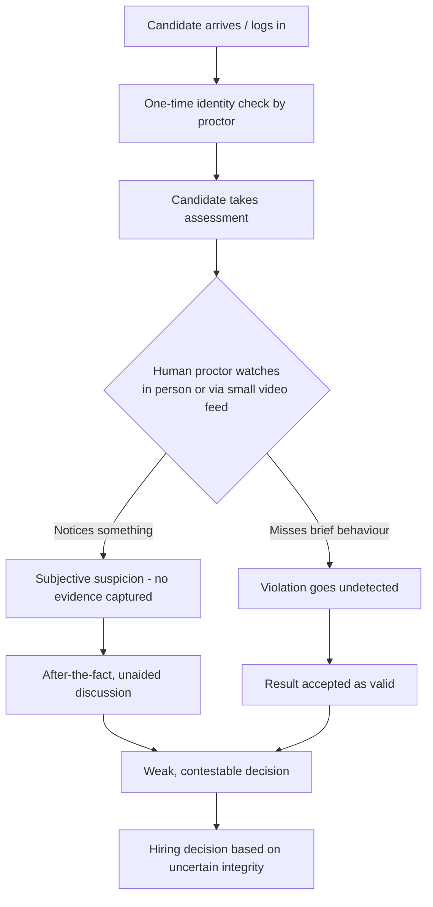
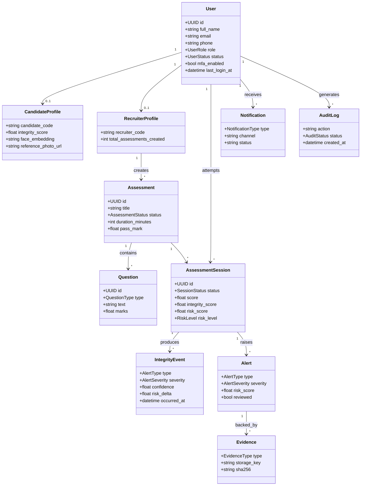
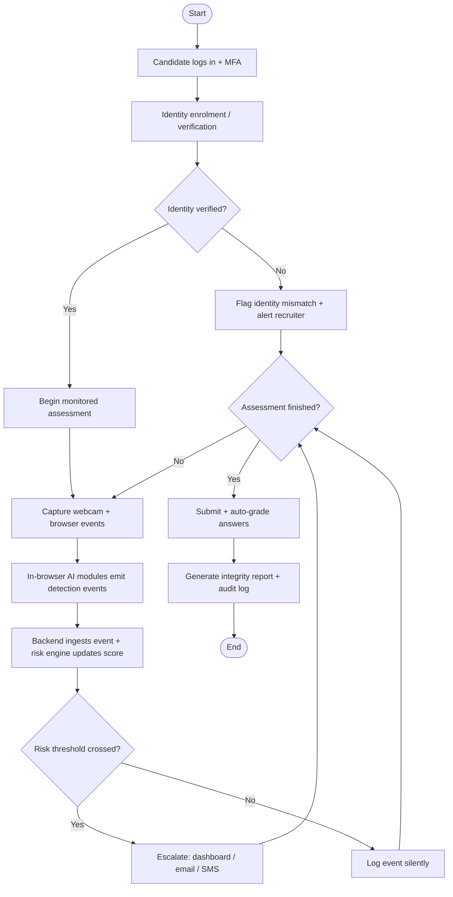
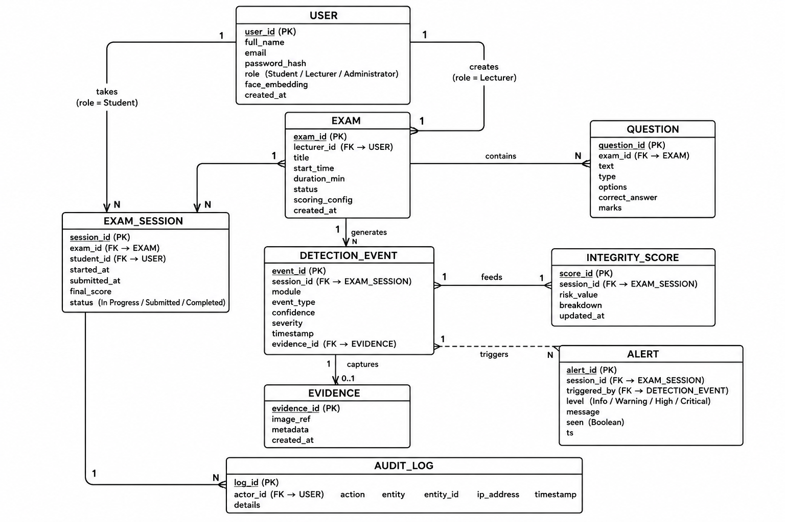
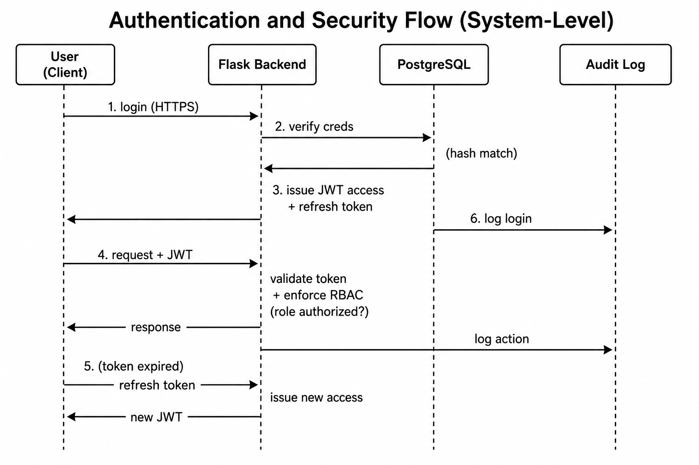

<!--
SemanticGuard AI — Final Year Project Report (Full Thesis Book)
Prepared in accordance with the "Organization of Research" and "Thesis Writing Course" guidelines.

FORMATTING GUIDE (apply on conversion to Word/PDF):
  Font: Times New Roman (TNR) throughout.
  L0 (Chapter titles / H1):   16pt, Centered, ALL CAPITALS, Bold
  L1 (Major headings / H2):   14pt, Centered, Title Case, Bold
  L2 (Sub-headings / H3):     12pt, Left margin, Title Case, Bold
  L3 (H4):                    12pt, Indented, Bold, Sentence case, ending with a period.
  L4 (H5):                    12pt, Indented, Bold, Italic, Sentence case, ending with a period.
  L5 (H6):                    12pt, Indented, Italic, Sentence case, ending with a period.
  Body: 12pt, normal, left aligned, 1.5 line spacing, justified.
  Margins: 1 inch (left 1.25 in for binding). Page numbers: preliminary pages in roman numerals,
  body in arabic numerals.

  To convert to Word:  pandoc "SemanticGuard-AI-Final-Report.md" -o "SemanticGuard-AI-Final-Report.docx"
  To convert to PDF:   pandoc "SemanticGuard-AI-Final-Report.md" -o "SemanticGuard-AI-Final-Report.pdf"
-->

<div align="center">


# SEMANTIC SERVICES RWANDA

### AI & Recruitment Technology Division

---

# AN AI-POWERED CANDIDATE FRAUD AND ONLINE ASSESSMENT INTEGRITY SYSTEM (SEMANTICGUARD AI)

A Final Year Project Report submitted in partial fulfillment of the
requirements for the award of a Bachelor's Degree in Information Technology

---

**BY**

**SHINGIRO Faisal**

**Software Engineer**

---

**Phone:** 0787947046 &nbsp;|&nbsp; **Email:** faisalshingiro10@gmail.com

**Case Study Organization:** Semantic Services Rwanda

**Academic Year:** 2025 – 2026

**Month/Year:** January 2026

</div>

<div style="page-break-after: always;"></div>

# DECLARATION

I, **SHINGIRO Faisal**, hereby declare that this Final Year Project Report entitled *"An AI-Powered Candidate Fraud and Online Assessment Integrity System (SemanticGuard AI)"* is my own original work and has not been submitted, in whole or in part, for any other degree, diploma, or academic award at this or any other institution. All sources of information, ideas, and quotations that have been used have been duly acknowledged in the text and in the list of references.

**Candidate:** SHINGIRO Faisal

Signature: _________________________  Date: _________________________

<div style="page-break-after: always;"></div>

# APPROVAL PAGE

This Final Year Project Report entitled *"An AI-Powered Candidate Fraud and Online Assessment Integrity System (SemanticGuard AI)"*, prepared and submitted by **SHINGIRO Faisal**, has been examined and approved as meeting the requirements for the partial fulfillment of the award of a Bachelor's Degree in Information Technology.

**Supervisor:**

Name: _________________________

Signature: _________________________  Date: _________________________

**Head of Department:**

Name: _________________________

Signature: _________________________  Date: _________________________

**External Examiner:**

Name: _________________________

Signature: _________________________  Date: _________________________

<div style="page-break-after: always;"></div>

# DEDICATION

To Almighty God, the source of all wisdom and understanding.

To my beloved family, whose patience, encouragement, and sacrifices have sustained me throughout this academic journey.

To the management and staff of **Semantic Services Rwanda**, whose vision for fair and technology-driven recruitment inspired this work.

And to every honest candidate who deserves an assessment process that rewards genuine effort.

<div style="page-break-after: always;"></div>

# ACKNOWLEDGEMENTS

I extend my deepest gratitude to Almighty God for the gift of life, health, and the strength to complete this project.

I sincerely thank my academic supervisor for the invaluable guidance, constructive criticism, and continuous support that shaped the direction and quality of this work. My appreciation also goes to the entire teaching staff of the Department of Information Technology for the knowledge and skills they imparted throughout my studies.

I am profoundly grateful to **Semantic Services Rwanda** and its parent organization, **tfSemanticServices GmbH (Germany)**, for granting me the opportunity to use their recruitment and assessment context as the case study for this project, and for the cooperation extended to me during requirements gathering and validation.

Finally, I thank my family, classmates, and friends for their unwavering moral and material support. May God richly bless you all.

<div style="page-break-after: always;"></div>

# ABSTRACT

The rapid migration of recruitment assessment from the supervised physical assessment centre to remote and computer-based settings has outpaced the capacity of traditional human proctoring, exposing organizations to widespread and largely undetected candidate fraud. A single human proctor cannot reliably supervise many candidates simultaneously, nor can a human observer detect the brief, subtle behaviours — a quick glance at a hidden phone, a moment of off-screen attention, the silent opening of another browser tab — through which assessment fraud typically occurs. Existing online proctoring solutions tend to address only a single channel of cheating, operate as opaque "black boxes", depend on costly continuous cloud processing, and rarely consolidate their findings into transparent, defensible evidence.

This project designed and developed **SemanticGuard AI**, an intelligent, web-based assessment integrity platform that integrates five complementary artificial-intelligence monitoring modules — face recognition and continuous identity verification, object (mobile phone) detection, eye-gaze tracking, head-pose estimation, and browser activity monitoring — into a single system, and fuses their outputs through a weighted risk-scoring engine into a transparent integrity risk score (0–100) for each candidate. The system was implemented as a multi-role web application using **React** and **TypeScript** on the front end, a **Flask (Python)** backend exposing a secure REST API, and a **PostgreSQL** database, with security enforced through JWT-based authentication, role-based authorization, multi-factor authentication, encryption, and comprehensive audit logging. Detected risk is escalated through a proportionate, multi-channel notification subsystem — in-dashboard alerts, email, and SMS delivered through the Africa's Talking gateway — so that recruiters are reached even when away from the monitoring dashboard.

The system was developed following the **Agile (Scrum)** methodology over an iterative, multi-phase plan, and was validated through a multi-layered testing strategy comprising unit, integration, system, performance, and security testing, complemented by quantitative evaluation of the AI modules using Precision, Recall, F1-score, and confusion matrices, and by user acceptance testing. The result is a functional integrity-monitoring platform that increases the proportion of fraudulent behaviour detected, reduces the manual burden on evaluators, delivers real-time alerts for timely intervention, and produces detailed, timestamped evidence and audit reports suitable for formal hiring-integrity reviews. By combining multi-signal detection with transparency, proportionality, and a human-in-the-loop design that augments rather than replaces human judgment, SemanticGuard AI provides an accurate, affordable, and trustworthy means of safeguarding the integrity and fairness of online recruitment assessment.

**Keywords:** assessment integrity, online proctoring, computer vision, face recognition, object detection, gaze tracking, risk scoring, recruitment technology.

<div style="page-break-after: always;"></div>

# TABLE OF CONTENTS

**DECLARATION** ............................................................................. ii
**APPROVAL PAGE** .......................................................................... iii
**DEDICATION** ............................................................................. iv
**ACKNOWLEDGEMENTS** ....................................................................... v
**ABSTRACT** ............................................................................... vi
**TABLE OF CONTENTS** ..................................................................... vii
**LIST OF FIGURES** ........................................................................ x
**LIST OF TABLES** ........................................................................ xi
**LIST OF ABBREVIATIONS AND ACRONYMS** .................................................... xii

**CHAPTER ONE: GENERAL INTRODUCTION** ....................................................... 1
- 1.1 Introduction
- 1.2 Background of the Study
- 1.3 Statement of the Problem
- 1.4 Choice and Motivation in the Study
- 1.5 Objectives of the Study
  - 1.5.1 General Objective
  - 1.5.2 Specific Objectives
- 1.6 Scope of the Project
- 1.7 Methodology and Techniques Used in the Study
- 1.8 Expected Results
- 1.9 Organization of the Report

**CHAPTER TWO: ANALYSIS OF THE CURRENT SYSTEM** ............................................ 12
- 2.1 Introduction
- 2.2 Description of the Current System Environment
  - 2.2.1 Historical Background
  - 2.2.2 Vision
  - 2.2.3 Mission
- 2.3 Description of the Current System
- 2.4 Analysis of the Current System
- 2.5 Modeling the Current System
- 2.6 Problems of the Current System
- 2.7 Proposed Solution
- 2.8 System Requirements
  - 2.8.1 Functional Requirements
  - 2.8.2 Non-Functional Requirements

**CHAPTER THREE: REQUIREMENTS ANALYSIS AND DESIGN OF THE NEW SYSTEM** ....................... 24
- 3.1 Introduction
- 3.2 Unified Modeling Language (UML)
- 3.3 Design of the New System – Diagrams
  - 3.3.1 Use-Case Diagram
  - 3.3.2 Class Diagram
  - 3.3.3 Sequence Diagram
  - 3.3.4 Activity Diagram
- 3.4 Database Diagram (Entity–Relationship Diagram)
- 3.5 Data Dictionary
- 3.6 System Architecture Design

**CHAPTER FOUR: IMPLEMENTATION OF THE NEW SYSTEM** ......................................... 40
- 4.1 Introduction
- 4.2 Technologies Used
  - 4.2.1 Front End
  - 4.2.2 Back End
  - 4.2.3 Artificial Intelligence and Computer Vision
- 4.3 Presentation of the New System
- 4.4 Software Testing
  - 4.4.1 Unit Testing
  - 4.4.2 Integration Testing
  - 4.4.3 System Testing
  - 4.4.4 Performance Testing
  - 4.4.5 Security Testing
  - 4.4.6 Validation of AI Results
- 4.5 Hardware and Software Requirements
  - 4.5.1 Client-Side Software Requirements
  - 4.5.2 Client-Side Hardware Requirements
  - 4.5.3 Server-Side Software Requirements
  - 4.5.4 Server-Side Hardware Requirements

**CHAPTER FIVE: CONCLUSIONS AND RECOMMENDATIONS** ......................................... 56
- 5.1 Conclusions
- 5.2 Recommendations

**REFERENCES** ............................................................................ 60
**APPENDICES** ............................................................................ 63

<div style="page-break-after: always;"></div>

# LIST OF FIGURES

**Figure 2.1:** Model of the Current (As-Is) Assessment Supervision Process
**Figure 3.1:** Use-Case Diagram of SemanticGuard AI
**Figure 3.2:** Class Diagram of SemanticGuard AI
**Figure 3.3:** Assessment-Monitoring Sequence Diagram
**Figure 3.4:** Activity Diagram of the Monitored Assessment Workflow
**Figure 3.5:** Entity–Relationship Diagram (ERD)
**Figure 3.6:** High-Level System Architecture
**Figure 3.7:** Authentication and Security Flow
**Figure 4.1:** Work Breakdown Structure
**Figure 4.2:** Project Schedule (Gantt Chart)

<div style="page-break-after: always;"></div>

# LIST OF TABLES

**Table 1.1:** Specific Objectives and Corresponding Detection Modules
**Table 2.1:** Functional Requirements of the New System
**Table 2.2:** Non-Functional Requirements of the New System
**Table 3.1:** Data Dictionary — Core Database Entities
**Table 3.2:** Risk-Score Event Weights Used by the Risk-Scoring Engine
**Table 3.3:** Risk-Score Notification Escalation Thresholds
**Table 4.1:** Front-End Technologies
**Table 4.2:** Back-End Technologies
**Table 4.3:** AI and Computer-Vision Technologies
**Table 4.4:** Sample Unit Test Cases and Results
**Table 4.5:** Sample Integration Test Cases and Results
**Table 4.6:** AI Module Evaluation Metrics (Illustrative)
**Table 4.7:** Client-Side Requirements
**Table 4.8:** Server-Side Requirements

<div style="page-break-after: always;"></div>

# LIST OF ABBREVIATIONS AND ACRONYMS

| Abbreviation | Meaning |
|---|---|
| AI | Artificial Intelligence |
| API | Application Programming Interface |
| ATS | Applicant Tracking System |
| CNN | Convolutional Neural Network |
| CRUD | Create, Read, Update, Delete |
| CV | Computer Vision |
| DBMS | Database Management System |
| ERD | Entity–Relationship Diagram |
| F1 | F1-score (harmonic mean of precision and recall) |
| HTTP/HTTPS | Hypertext Transfer Protocol (Secure) |
| JWT | JSON Web Token |
| mAP | mean Average Precision |
| MFA | Multi-Factor Authentication |
| ML | Machine Learning |
| ORM | Object–Relational Mapping |
| OTP | One-Time Password |
| RBAC | Role-Based Access Control |
| REST | Representational State Transfer |
| SaaS | Software as a Service |
| SMS | Short Message Service |
| SMTP | Simple Mail Transfer Protocol |
| SPA | Single-Page Application |
| SQL | Structured Query Language |
| TLS | Transport Layer Security |
| TOTP | Time-based One-Time Password |
| UAT | User Acceptance Testing |
| UI/UX | User Interface / User Experience |
| UML | Unified Modeling Language |
| WBS | Work Breakdown Structure |
| YOLO | You Only Look Once (object-detection family) |
| YPP | Young Professional Program |

<div style="page-break-after: always;"></div>

# CHAPTER ONE: GENERAL INTRODUCTION

## 1.1 Introduction

This chapter introduces the project and establishes the foundation upon which the entire report is built. It presents the background that motivated the development of an AI-powered assessment integrity system, articulates the problem the project addresses, and states the choice and motivation behind the study. It further defines the general and specific objectives, delimits the scope of the work, outlines the methodology and techniques adopted, describes the expected results, and finally explains how the remainder of the report is organized. Collectively, these sections frame *SemanticGuard AI* as a response to a real and growing challenge in modern recruitment: the reliable detection of candidate fraud in computer-based and remote assessments.

## 1.2 Background of the Study

Fair and reliable assessment is the cornerstone upon which the credibility of any hiring process rests. The scores, rankings, and pass decisions produced by a recruitment assessment are, in essence, formal guarantees that a candidate has genuinely demonstrated a defined body of knowledge and skills. When the integrity of an assessment is compromised, the value of those guarantees collapses, eroding trust in the hiring process and devaluing the genuine achievements of honest candidates. For this reason, safeguarding the integrity of assessments has always been a central concern of employers, recruitment agencies, and talent-acquisition teams worldwide.

Over the past decade, the landscape of recruitment assessment has changed dramatically. The rapid adoption of remote-hiring platforms, the global disruption caused by the COVID-19 pandemic, and the growing demand for flexible, distributed work have pushed assessments out of the tightly controlled physical assessment centre and onto candidates' personal computers and mobile devices. While this transition has expanded access to opportunity and improved convenience for both employers and applicants, it has simultaneously widened the opportunities for assessment fraud. In a traditional, supervised assessment room, a single proctor can visually supervise dozens of candidates; in a remote or computer-based setting, that human oversight is either absent, severely diluted, or limited to a small video thumbnail that an evaluator cannot realistically monitor for every candidate at once.

The methods used to commit fraud have also evolved in sophistication. Candidates may impersonate one another, consult a hidden smartphone, open unauthorized browser tabs or applications, receive whispered or written assistance from a person outside the camera's view, or repeatedly glance at concealed notes. Many of these behaviours are brief, subtle, and easy to disguise, making them extremely difficult for a human observer to detect reliably, particularly across many simultaneous candidates and over the full duration of a lengthy assessment. Traditional proctoring, whether in person or through basic video conferencing, simply does not scale to meet this challenge, and it is inherently vulnerable to fatigue, distraction, and human error.

In parallel with these challenges, the field of artificial intelligence (AI) — and in particular computer vision and machine learning — has matured to the point where many tasks that once required constant human attention can now be automated with high accuracy and in real time. Modern face recognition algorithms can verify a person's identity from a single camera frame; object detection models can locate a mobile phone within a video stream in milliseconds; gaze estimation and head-pose estimation techniques can infer where a person is looking and how their head is oriented; and browser-level monitoring can detect when a candidate navigates away from the assessment window. Individually, each of these capabilities addresses one narrow avenue of fraud. Combined and orchestrated within a single, coherent system, they offer the possibility of continuous, objective, and tireless supervision that augments — rather than replaces — the human evaluator.

Despite the availability of these technologies, many organizations still rely on fragmented, manual, or partially automated approaches to assessment security. Commercial online proctoring tools exist, but they are frequently expensive, closed and proprietary, heavily dependent on continuous cloud processing, and often limited to a single detection modality such as identity verification or tab-switch logging. Few solutions integrate multiple AI detection signals into a unified, explainable integrity assessment that recruiters can act upon with confidence. There remains a clear need for a system that brings these capabilities together, presents their findings transparently, and respects the operational realities of cost, privacy, and ease of use.

The proposed AI-Powered Candidate Fraud and Online Assessment Integrity System, referred to throughout this report as **SemanticGuard AI**, is designed to address precisely this gap. It is a web-based assessment integrity platform that combines five complementary AI monitoring modules — face recognition, object (mobile phone) detection, eye-gaze tracking, head-pose estimation, and browser activity monitoring — into a single risk-scoring engine. By fusing these independent signals into one transparent integrity metric, supported by detailed evidence logs and real-time alerts, the system aims to give recruiters and hiring-integrity officers a practical, scalable, and trustworthy tool for protecting the fairness and credibility of their assessments.

## 1.3 Statement of the Problem

The central problem this project addresses is that existing assessment supervision methods cannot reliably detect candidate fraud in computer-based and remote recruitment assessments at scale, leaving organizations exposed to widespread, undetected cheating that undermines the validity of their hiring decisions.

In conventional proctoring, a human supervisor must continuously watch every candidate for the entire duration of an assessment. This is cognitively impossible to do well: attention naturally drifts, a single proctor cannot simultaneously observe many candidates, and the most common fraudulent behaviours — a quick glance at a hidden phone, a brief look off-screen, a moment of whispered help, or the silent opening of another browser tab — are deliberately short and unobtrusive. In remote settings the difficulty is compounded, because the proctor often sees only a small, low-resolution video feed, has no view of the candidate's surroundings, and cannot inspect what is happening on the candidate's screen. As a result, a large proportion of fraudulent behaviour goes entirely unnoticed.

The root cause of this problem is the absence of an integrated, automated supervision system that can monitor multiple independent channels of evidence at once, continuously, and objectively. The avenues of fraud are diverse — identity, physical devices, visual attention, head movement, and on-screen activity — and no single detection technique can cover them all. A face-only verification system cannot detect a hidden phone; a tab-switch logger cannot detect an impersonator or a person feeding answers from off-camera. Where automated tools do exist, they typically address only one of these channels, operate as opaque "black boxes" that flag candidates without explaining why, depend on costly continuous cloud processing, and rarely consolidate their outputs into a single, interpretable measure of risk that a recruiter can review and justify.

The consequences of this gap are serious and far-reaching. Honest candidates are unfairly disadvantaged when fraudulent applicants obtain undeserved scores and advance in the hiring process. Organizations make hiring decisions whose validity cannot be defended, exposing them to costly mis-hires and reputational damage. Recruiters lack credible, evidence-backed grounds on which to disqualify or challenge a suspicious result, so even suspected fraud frequently goes unchallenged. Over time, the perception that "everyone cheats and no one is caught" corrodes trust in the assessment process, discourages genuine candidates, and weakens the value of the assessment as a selection tool. Without an intelligent, multi-signal, evidence-producing system that continuously supervises assessments and presents its findings transparently, organizations remain unable to uphold the integrity on which fair and effective hiring depends.

## 1.4 Choice and Motivation in the Study

The choice of this project arose from the convergence of three forces that make a solution both necessary and feasible. First, the shift toward computer-based and remote assessment — accelerated by the pandemic and now a permanent feature of modern hiring — has dramatically increased the opportunity and incidence of fraud, while simultaneously weakening traditional human proctoring. Second, the AI technologies required to automate reliable, real-time supervision — face recognition, object detection, gaze and head-pose estimation — have matured and become accessible through well-supported open-source libraries, making it practical to deploy them without prohibitive cost. Third, employers and talent-acquisition teams are placing ever greater emphasis on demonstrable, evidence-based hiring integrity, creating strong demand for tools that not only detect fraud but document it defensibly.

The motivation is reinforced by the needs of the system's intended users. Recruiters want to focus on evaluating talent rather than straining to watch dozens of video feeds; they need a tool that does the watching for them and surfaces only the moments that warrant attention. Hiring-integrity officers need solid, well-documented evidence — timestamped logs, captured frames, and a clear rationale — before they can act on a suspected case. Candidates, for their part, benefit from a fairer assessment environment in which genuine effort is properly rewarded and is not undermined by applicants who cheat with impunity. The personal motivation of the researcher lies in applying contemporary computer-vision and full-stack engineering skills to a socially valuable problem, and in demonstrating that an affordable, transparent, locally controllable alternative to costly proprietary proctoring platforms can be built and validated. Conducting the study within **Semantic Services Rwanda**, an organization whose Young Professional Program depends heavily on candidate assessment, grounds the work in a real and representative operational context.

## 1.5 Objectives of the Study

### 1.5.1 General Objective

The general objective of this project is to design and develop an AI-powered, web-based assessment integrity system that integrates face recognition, object detection, eye-gaze tracking, head-pose estimation, and browser activity monitoring into a unified risk-scoring engine, in order to detect candidate fraud and assessment cheating accurately, continuously, and transparently in computer-based recruitment assessments.

### 1.5.2 Specific Objectives

The specific objectives of the study are as follows:

1. **To implement a face recognition and identity verification module** that authenticates each candidate and detects impersonation throughout the assessment, operating reliably under realistic variations in lighting, camera quality, and head movement, and flagging any mismatch or the appearance of an unrecognized or additional face.
2. **To develop an object detection module** capable of identifying unauthorized mobile phones and similar devices within the candidate's camera view in real time, with high precision and minimal false alarms, recording each detection as time-stamped evidence.
3. **To build eye-gaze tracking and head-pose estimation modules** that monitor the candidate's visual attention and detect sustained off-screen behaviour, while tolerating the brief, natural movements typical of honest test-taking.
4. **To implement a browser activity monitoring module** that detects tab switching, loss of window focus, and attempts to access external on-screen resources, logging each event with a precise timestamp.
5. **To design a risk-scoring engine, a secure recruiter dashboard, and a multi-channel notification subsystem** that fuse all detection signals into a single integrity metric, deliver proportionate real-time alerts across in-dashboard notifications, email, and SMS (via the Africa's Talking gateway), and produce auditable evidence reports, while enforcing strong security through JWT-based authentication, encryption, and comprehensive audit logging.

**Table 1.1: Specific Objectives and Corresponding Detection Modules**

| # | Specific Objective | Implemented Module / Component | Primary Output |
|---|---|---|---|
| 1 | Identity verification | Face recognition module | Identity-mismatch / multiple-faces events |
| 2 | Prohibited-device detection | YOLO-based object detection module | Phone / object-detected events |
| 3 | Attention monitoring | Eye-gaze tracking + head-pose estimation | Looking-away events |
| 4 | On-screen activity monitoring | Browser activity monitor | Tab-switch / window-unfocused events |
| 5 | Fusion, alerting, security | Risk-scoring engine + dashboard + notifications | Integrity score (0–100) + alerts + reports |

## 1.6 Scope of the Project

The scope of this project defines precisely which components were developed and which elements lie outside the project boundaries. The goal was to deliver a functional, web-based assessment integrity platform that combines multiple AI monitoring techniques into a single, usable system for recruiters, candidates, and administrators.

**The project includes:**

- A **multi-role web application** (React + TypeScript) providing distinct interfaces for candidates (registration, identity enrolment, taking monitored assessments), recruiters (creating assessments, live monitoring, reviewing integrity reports, evaluating candidates), and administrators (user management, system settings, audit oversight).
- **Face recognition and identity verification** through biometric enrolment and continuous verification during the assessment.
- **Object (mobile phone) detection** in real time within the candidate's camera view.
- **Eye-gaze tracking and head-pose estimation** for continuous attention monitoring.
- **Browser activity monitoring** that detects and logs tab switching and focus loss.
- A **risk-scoring engine** that fuses all detection signals into a single composite integrity score (0–100), with configurable weighting.
- A **real-time recruiter dashboard and alerting** facility.
- **Multi-channel, threshold-based notifications** across dashboard, email, and SMS (Africa's Talking gateway).
- **Evidence, reporting, and audit logging** producing detailed, timestamped, tamper-evident records.
- **Security and data protection** through JWT authentication, MFA, role-based authorization, encryption, and audit logging, backed by a PostgreSQL database and a Flask (Python) backend.

**The project does not include:**

- A **formal disciplinary or adjudication system**; the platform flags and documents suspected fraud but does not impose penalties or replace human hiring decisions.
- **Fully autonomous decision-making**; all high-risk findings are intended for human review.
- A **complete applicant tracking or talent-management system** (job-posting management, interview scheduling, offer workflows).
- **Specialized or hardware-based proctoring equipment**; monitoring relies on a standard webcam and web browser.
- **Detection of advanced collusion conducted entirely off-device** that leaves no observable trace within the monitored channels (for example, an inaudible earpiece).

## 1.7 Methodology and Techniques Used in the Study

The project adopted the **Agile software development methodology**, specifically the **Scrum framework**, because an AI-driven, multi-module web application demands an iterative, feedback-driven process rather than a rigid, linear one. Development was organized into short, time-boxed sprints, each producing a tangible, testable increment. Early sprints established the foundational architecture — authentication, the database schema, and the basic assessment workflow — while subsequent sprints progressively added and refined the detection modules, the risk-scoring engine, and the recruiter dashboard. This incremental approach was particularly valuable for the AI components, where accuracy is achieved through repeated cycles of integration, measurement, and tuning.

A range of **data-collection and requirements techniques** supported the study:

- *Interviews.* Structured and informal interviews were held with recruiters and assessment coordinators at the case-study organization to understand the existing supervision process, its weaknesses, and user expectations.
- *Documentation review.* Existing recruitment and assessment materials, together with the scholarly and technical literature on online proctoring and computer vision, were reviewed to ground the design in established practice.
- *Observation.* Direct observation of how assessments are currently conducted and supervised informed the analysis of the as-is system.
- *Use of public datasets and controlled primary collection.* Established open datasets (for faces, objects, and gaze) together with short, consented volunteer recordings of honest and simulated-fraud behaviour were used to calibrate and validate the detection thresholds.
- *Prototyping.* Interface prototypes were produced and refined iteratively to validate the user experience before and during implementation.

The complete methodology, including the development approach, tools and technologies, data-collection methods, ethical considerations, and the testing and validation strategy, is elaborated and applied in Chapters Three and Four.

## 1.8 Expected Results

Upon completion, the project was expected to deliver a fully functional, well-documented assessment integrity platform capable of monitoring computer-based recruitment assessments across five independent channels of evidence and consolidating its findings into a single, explainable integrity score for each candidate. Specifically, the expected results were:

1. A fully functional assessment integrity web application with three role-based interfaces.
2. Five integrated AI detection modules producing time-stamped detection events.
3. A composite risk-scoring engine fusing all signals into a transparent 0–100 integrity score.
4. A multi-channel notification subsystem escalating alerts proportionately to risk.
5. A fully designed and implemented PostgreSQL database.
6. A complete security layer (JWT authentication, MFA, RBAC, encryption, audit logging).
7. Evidence, reporting, and audit outputs suitable for hiring-integrity reviews.
8. Comprehensive system documentation and testing/validation reports.

In terms of impact, the system was expected to increase the proportion of fraudulent behaviour detected, reduce the manual burden on evaluators, deliver real-time alerts that enable timely intervention, and provide credible, timestamped evidence that strengthens the organization's ability to uphold hiring integrity.

## 1.9 Organization of the Report

This report is organized into five chapters, followed by references and appendices:

- **Chapter One — General Introduction** introduces the project, its background, problem statement, motivation, objectives, scope, methodology, and expected results.
- **Chapter Two — Analysis of the Current System** describes the case-study environment and the existing ("as-is") assessment supervision process, analyses and models it, identifies its problems, proposes a solution, and states the functional and non-functional requirements of the new system.
- **Chapter Three — Requirements Analysis and Design of the New System** presents the design of SemanticGuard AI using UML models (use-case, class, sequence, and activity diagrams), the entity–relationship diagram, the data dictionary, and the overall system architecture.
- **Chapter Four — Implementation of the New System** describes the technologies used, presents the implemented system through screenshots and descriptions, details the software-testing strategy and AI validation, and specifies the hardware and software requirements.
- **Chapter Five — Conclusions and Recommendations** summarizes the achievement of the objectives, acknowledges limitations, and proposes directions for future work.

The report concludes with a list of **References** and a set of **Appendices** containing supporting documents.

<div style="page-break-after: always;"></div>

# CHAPTER TWO: ANALYSIS OF THE CURRENT SYSTEM

## 2.1 Introduction

This chapter examines the existing assessment-supervision process within the case-study context of **Semantic Services Rwanda** and establishes the basis for the proposed solution. It begins by describing the organizational environment — including its historical background, vision, and mission — before describing and analysing the current system through which recruitment assessments are conducted and supervised. The current process is then modelled, its problems are identified in a structured manner, and a solution is proposed. The chapter closes by specifying the functional and non-functional requirements that the new system, SemanticGuard AI, must satisfy.

## 2.2 Description of the Current System Environment

### 2.2.1 Historical Background

**Semantic Services Rwanda** is a private software company specializing in artificial intelligence, spatial computing, and innovative Software-as-a-Service (SaaS) solutions, while also empowering young Rwandan software developers through structured training and recruitment programs. The company develops software solutions that leverage artificial intelligence, spatial computing, mixed reality, virtual reality, and augmented reality to enhance business operations and digital transformation. Its SaaS products are designed to make business processes more tangible, improve employee performance, and integrate seamlessly across industries such as IT, tourism, recruitment, finance, training, and gaming. The company is supported by its parent organization, **tfSemanticServices GmbH** in Germany, ensuring access to advanced technology and research.

A defining activity of the organization is its **Young Professional Program (YPP)** — a five-year initiative designed to recruit and train early-career Rwandan software developers in spatial computing and IT. The program provides structured recruitment, hands-on training and mentorship, real-world project experience, and job placement for top-performing candidates. The YPP partners with organizations such as the University of Rwanda, INES Ruhengeri, and Carnegie Mellon University Africa to source and develop talent, aiming to cultivate the next generation of technology leaders in Rwanda. Because the YPP and the company's wider recruitment and certification activities depend heavily on assessing candidates — frequently through computer-based assessments, coding challenges, and remotely supervised recruitment tests — the integrity of those assessments is of direct operational importance to the organization, making it a representative and relevant case study for an assessment-integrity system.

### 2.2.2 Vision

To be a leading African technology company that advances digital transformation through artificial intelligence and spatial computing, while nurturing a new generation of skilled, trustworthy technology professionals selected on genuine merit.

### 2.2.3 Mission

To deliver innovative, reliable software solutions and to recruit, train, and place young technology talent through fair, rigorous, and transparent assessment processes that uphold the integrity and credibility of every selection decision.

## 2.3 Description of the Current System

Within the case-study context, the assessment process is a core component of both the company's recruitment pipeline and its talent-selection model. Candidates sit structured assessments — including multiple-choice tests, short-answer questions, and coding challenges — to demonstrate competence; the results inform selection within the YPP, certification, and eventual job placement. At present, these assessments are supervised through a combination of **manual, in-person proctoring** and **basic remote tools** such as video calls and conventional online test platforms.

Supervision relies on a human evaluator watching candidates either physically or through a small video feed. There is no automated, continuous monitoring of identity, attention, devices, or on-screen activity, and no consolidated, evidence-backed measure of assessment integrity. Identity is typically checked only once, at the start of the session; thereafter, the system assumes the enrolled candidate remains present and honest. Any suspicion of misconduct depends entirely on a human noticing it in the moment, and any subsequent action depends on that human's unaided recollection, since no structured evidence is captured.

## 2.4 Analysis of the Current System

A structured analysis of the current process, organized around the recognized dimensions of system evaluation (performance, information, economics, control and security, efficiency, and service), reveals systematic weaknesses:

- **Performance.** Manual proctoring does not scale: a single evaluator's effective attention is divided across all candidates, so the probability of detecting any given violation falls sharply as the number of candidates rises. In remote settings, low-resolution video and network latency further degrade the evaluator's ability to observe candidates, and there is no mechanism to monitor the candidate's screen or surroundings continuously.
- **Information.** The current process produces little usable information. Suspicions are subjective and rarely documented; there is no structured, timestamped record of detection events, no objective measure of risk per candidate, and no consolidated report. Decisions about suspected fraud therefore rest on weak, contestable evidence.
- **Economics.** Relying on additional human proctors to improve coverage is costly and still ineffective, while commercial proctoring platforms are expensive, typically licensed per-assessment or per-candidate, and depend on continuous cloud processing. The organization faces a poor cost-to-effectiveness ratio under every existing option.
- **Control and Security.** There is no continuous identity assurance, leaving the process vulnerable to impersonation, and no tamper-evident audit trail of supervisory actions or detected events. Sensitive candidate data, where captured, is not consistently protected through authentication, authorization, encryption, and logging.
- **Efficiency.** Evaluators expend substantial effort watching candidates who behave honestly, with no tooling to direct their attention only to genuinely suspicious sessions. Post-assessment review of recordings, where it occurs at all, is slow and labour-intensive.
- **Service.** The current approach offers no real-time alerting, no proportionate escalation to reach an offline supervisor, and no defensible evidence package for subsequent integrity reviews — leaving both honest candidates and the organization poorly served.

## 2.5 Modeling the Current System

The current ("as-is") supervision process can be modelled as a largely manual, single-channel workflow. The candidate is verified once at log-in and then takes the assessment while a human proctor attempts to observe behaviour either in person or through a single video feed. No automated detection occurs, no structured events are recorded, and any concern is raised only after the fact and without supporting evidence. Figure 2.1 illustrates this process.

**Figure 2.1: Model of the Current (As-Is) Assessment Supervision Process**



## 2.6 Problems of the Current System

The as-is analysis confirms that the current, predominantly manual supervision process cannot reliably guarantee the integrity of computer-based assessments at scale. The principal problems are:

1. **Limited supervisory capacity.** A single evaluator cannot reliably observe many candidates simultaneously, particularly in remote settings where only a small video thumbnail is visible.
2. **Undetected, short-duration violations.** The most common forms of fraud — a brief glance at a hidden phone, a quick look off-screen, or silently opening another tab — are easily missed by a fatigued or distracted human observer.
3. **No identity assurance during the assessment.** Beyond an initial check, there is no continuous verification that the enrolled candidate — and only that candidate — remains present.
4. **Fragmented or absent evidence.** When fraud is suspected, there is rarely a consolidated, timestamped evidentiary record on which a defensible decision can be based.
5. **Delayed, after-the-fact response.** Concerns are typically raised only after the assessment, by which time timely intervention is no longer possible, and an offline supervisor receives no out-of-band alert.

## 2.7 Proposed Solution

To remedy these deficiencies, the project proposes **SemanticGuard AI**, a web-based assessment integrity platform that continuously monitors candidates across five complementary channels of evidence — face recognition, object (mobile phone) detection, eye-gaze tracking, head-pose estimation, and browser activity monitoring — and fuses their outputs through a weighted risk-scoring engine into a single, transparent integrity score (0–100) for every candidate.

Rather than relying on a single detection technique, the system orchestrates all five signals within one coherent application. Lightweight perception runs in the candidate's browser, emitting compact, structured detection events and selective evidence frames rather than streaming continuous raw video to the cloud, thereby favouring privacy and bandwidth efficiency. The backend validates and stores these events, recomputes the running integrity score, and — when configured risk thresholds are exceeded — escalates alerts proportionately through in-dashboard notifications, email, and SMS (via the Africa's Talking gateway). Every event is preserved as detailed evidence and tamper-evident audit logs. Crucially, the solution is designed around **human-in-the-loop decision-making**: it detects, quantifies, explains, and documents suspicious behaviour, but leaves the final judgment to a responsible recruiter or hiring-integrity officer.

## 2.8 System Requirements

### 2.8.1 Functional Requirements

The functional requirements describe what the system must do. They are summarized in Table 2.1.

**Table 2.1: Functional Requirements of the New System**

| ID | Functional Requirement |
|---|---|
| FR-01 | The system shall allow users to register and authenticate with role-based access (candidate, recruiter, administrator). |
| FR-02 | The system shall support multi-factor authentication (TOTP authenticator app or email one-time code). |
| FR-03 | The system shall allow candidates to enrol their facial identity during onboarding. |
| FR-04 | The system shall allow recruiters to create, configure, and publish assessments containing multiple-choice, true/false, short-answer, and coding questions. |
| FR-05 | The system shall capture the candidate's webcam stream and browser-activity events during a monitored assessment. |
| FR-06 | The system shall continuously verify candidate identity and flag impersonation or additional faces. |
| FR-07 | The system shall detect prohibited mobile phones and similar objects in real time. |
| FR-08 | The system shall track eye-gaze and head-pose and flag sustained off-screen attention. |
| FR-09 | The system shall detect and log tab switching and loss of assessment-window focus. |
| FR-10 | The system shall fuse all detection signals into a composite integrity risk score (0–100) per candidate. |
| FR-11 | The system shall present recruiters with a real-time monitoring dashboard and live alerts. |
| FR-12 | The system shall escalate notifications across dashboard, email, and SMS according to configurable risk thresholds. |
| FR-13 | The system shall generate detailed, timestamped integrity reports and exportable evidence. |
| FR-14 | The system shall maintain a comprehensive, tamper-evident audit log of all significant actions. |
| FR-15 | The system shall allow administrators to manage users, roles, scoring weights, and system settings. |

### 2.8.2 Non-Functional Requirements

The non-functional requirements describe the quality attributes the system must exhibit. They are summarized in Table 2.2.

**Table 2.2: Non-Functional Requirements of the New System**

| ID | Non-Functional Requirement |
|---|---|
| NFR-01 | **Performance.** In-browser detection and alert delivery shall operate in near real time with minimal latency. |
| NFR-02 | **Security.** All traffic shall use HTTPS/TLS; credentials shall be hashed; sensitive records shall be encrypted; access shall be enforced through JWT and RBAC. |
| NFR-03 | **Usability.** Interfaces shall be clear, responsive, and consistent, following recognized UI/UX heuristics. |
| NFR-04 | **Reliability.** The system shall record events and recompute scores accurately and consistently, even under intermittent connectivity. |
| NFR-05 | **Privacy.** The system shall minimize data capture, transmitting compact events and selective frames rather than continuous raw video. |
| NFR-06 | **Scalability.** The architecture shall support concurrent monitored sessions and be horizontally extensible. |
| NFR-07 | **Maintainability.** Components shall be loosely coupled through well-defined REST interfaces to support extension and maintenance. |
| NFR-08 | **Auditability.** Every detection event, notification, and administrative action shall be traceable through the audit log. |
| NFR-09 | **Portability.** The client shall run on standard modern web browsers without specialized hardware. |
| NFR-10 | **Transparency.** Every integrity score shall be explainable through the underlying, timestamped evidence. |

<div style="page-break-after: always;"></div>

# CHAPTER THREE: REQUIREMENTS ANALYSIS AND DESIGN OF THE NEW SYSTEM

## 3.1 Introduction

This chapter presents the analysis and design of the new system, SemanticGuard AI. It translates the requirements established in Chapter Two into a concrete technical blueprint. The chapter introduces the modelling notation used (the Unified Modeling Language), then presents the principal design models of the system — the use-case, class, sequence, and activity diagrams — followed by the database design expressed as an entity–relationship diagram and a supporting data dictionary. The chapter concludes with the high-level system architecture and the authentication and security design. Each diagram is accompanied by an explanation of what it represents and how it informs the implementation.

## 3.2 Unified Modeling Language (UML)

The Unified Modeling Language (UML) is the standard graphical notation used in software engineering to specify, visualize, and document the artefacts of a software system. UML provides a family of complementary diagrams, each emphasizing a different view of the system: use-case diagrams capture functional requirements from the perspective of external actors; class diagrams describe the static structure of the system in terms of classes and their relationships; sequence diagrams describe the dynamic interaction between objects over time; and activity diagrams describe the flow of control through a process or workflow. This project uses UML to model SemanticGuard AI because the system has multiple actors, a rich domain model, and time-ordered interactions among its client, AI modules, backend, and database that benefit from precise, standardized representation.

## 3.3 Design of the New System – Diagrams

### 3.3.1 Use-Case Diagram

The use-case model captures the principal interactions between the system's actors — **Candidate**, **Recruiter**, **Administrator**, and the autonomous **AI Monitoring Engine** — and the system. The candidate registers, enrols a facial identity, and takes monitored assessments; the recruiter creates assessments, monitors live sessions, reviews integrity reports, and evaluates candidates; the administrator manages users, roles, scoring weights, and audit oversight; and the AI Monitoring Engine continuously analyses video and browser signals, raises detection events, and updates the risk score. Figure 3.1 presents the use-case diagram.

**Figure 3.1: Use-Case Diagram of SemanticGuard AI**


The diagram clarifies the functional boundaries of the platform and the responsibilities of each role, ensuring that every functional requirement identified in Chapter Two is owned by at least one actor and realized by at least one use case.

### 3.3.2 Class Diagram

The class diagram describes the static structure of the system's domain model. The principal classes mirror the persistent entities implemented in the system: `User` (with its specialized `CandidateProfile` and `RecruiterProfile`), `Role` and `Permission`, `Assessment`, `Question` (with `TestCase` for coding questions), `AssessmentSession` and `Answer`, `IntegrityEvent`, `Alert`, `Evidence`, `Notification`, `AuditLog`, and `SystemSetting`. These classes are related through associations such as a recruiter *creating* many assessments, a candidate *attempting* many sessions, a session *producing* many integrity events and alerts, and an alert *being backed by* one or more evidence records. Figure 3.2 presents the class diagram.

**Figure 3.2: Class Diagram of SemanticGuard AI**



### 3.3.3 Sequence Diagram

The sequence diagram describes the central scenario — a candidate taking a monitored assessment — showing how the client, AI modules, backend, risk-scoring engine, database, and recruiter dashboard interact in real time. Figure 3.3 presents this interaction.

**Figure 3.3: Assessment-Monitoring Sequence Diagram**


As shown, the client captures webcam frames and browser events; the in-browser AI modules transform these into discrete detection events; the backend ingests and validates each event, recomputes the running integrity score through the risk-scoring engine, and persists the event and any resulting alert; and, where thresholds are crossed, the notification service escalates the alert to the recruiter's dashboard, email, or phone while the live dashboard reflects the updated score in real time.

### 3.3.4 Activity Diagram

The activity diagram models the flow of control through the monitored assessment workflow, from candidate authentication and identity enrolment, through the continuous detect–score–escalate loop that runs for the duration of the assessment, to submission, scoring, and report generation. Figure 3.4 presents this workflow.

**Figure 3.4: Activity Diagram of the Monitored Assessment Workflow**



## 3.4 Database Diagram (Entity–Relationship Diagram)

The data model defines the persistent structures that underpin the system. The central entities are the **users** (and their candidate/recruiter profiles), the **assessments** they create or take, the **questions** and **test cases** that compose an assessment, the monitored **sessions** and their per-question **answers**, the **integrity events** produced during those sessions, the resulting **alerts** and **evidence**, and the **notifications**, **audit logs**, and **system settings** that ensure accountability and configurability. Figure 3.5 presents the entity–relationship diagram.

**Figure 3.5: Entity–Relationship Diagram (ERD)**



## 3.5 Data Dictionary

The data dictionary documents the core entities of the database, their key attributes, and their purpose. Table 3.1 summarizes the principal entities; each table additionally carries a UUID primary key (`id`) and `created_at` / `updated_at` timestamps inherited from a common base model.

**Table 3.1: Data Dictionary — Core Database Entities**

| Entity (Table) | Key Attributes | Description |
|---|---|---|
| `users` | full_name, email, phone, password_hash, role_name, status, mfa_enabled, mfa_secret, email_verified, last_login_at | Stores all user accounts and authentication/MFA state. |
| `candidate_profiles` | candidate_code, department, position, integrity_score, face_embedding, reference_photo_url | One-to-one extension of a candidate user, including the enrolled face embedding. |
| `recruiter_profiles` | recruiter_code, department, total_assessments_created | One-to-one extension of a recruiter user. |
| `roles` / `permissions` | name, description | Define role-based access control (RBAC) and the permissions assigned to each role. |
| `assessments` | title, description, status, duration_minutes, pass_mark, created_by | Assessment definitions created by recruiters. |
| `questions` | type, text, options, marks, correct_answer | Questions belonging to an assessment (multiple-choice, true/false, short-answer, coding). |
| `test_cases` | input, expected_output, is_hidden | Test cases used to auto-grade coding questions. |
| `assessment_sessions` | candidate_id, assessment_id, status, score, percentage, passed, integrity_score, risk_score, risk_level, tab_switch_count, looking_away_count, live_status | A candidate's monitored attempt, including scoring and integrity summary. |
| `answers` | session_id, question_id, response, is_correct, awarded_marks, test_results | A candidate's response to a single question. |
| `integrity_events` | session_id, type, severity, confidence, risk_delta, occurred_at, payload, processed | Raw, high-volume detection signals emitted by the AI pipeline. |
| `alerts` | session_id, candidate_id, type, severity, description, risk_score, occurred_at, reviewed, reviewed_by, resolution_note | Aggregated, reviewable alerts raised from one or more events. |
| `evidence` | session_id, alert_id, type, storage_key, url, sha256, captured_at | Stored media (screenshots/snapshots) backing an alert, with a SHA-256 tamper-evidence checksum. |
| `notifications` | user_id, type, channel, title, message, status, read_at | Multi-channel notifications dispatched to users, with delivery status. |
| `audit_logs` | user_id, action, status, ip_address, created_at, metadata | Tamper-evident record of all significant actions. |
| `system_settings` | key, value | Administrator-configurable system-wide settings (including scoring weights and thresholds). |
| `token_blocklist` | jti, created_at | Revoked JWT identifiers, supporting secure logout. |

## 3.6 System Architecture Design

The system architecture is organized into five integrated layers that cooperate to deliver continuous monitoring, transparent risk assessment, and secure record-keeping:

- **Client (Presentation) Layer** — a React + TypeScript single-page application that renders the role-specific interfaces and, during an assessment, captures the candidate's webcam stream and browser-activity events.
- **AI Detection Layer** — the five monitoring modules that transform raw video and browser signals into discrete detection events. Lightweight perception (facial-landmark, gaze, and focus tracking) runs in the browser; heavier models (object detection, face embedding) run in a dedicated AI worker.
- **Application (Backend) Layer** — a Flask application exposing a secure REST API that coordinates authentication, assessment management, ingestion of detection events, the risk-scoring engine, and a multi-channel notification service (dashboard via WebSockets, email via SMTP, and SMS via the Africa's Talking gateway).
- **Data Layer** — a PostgreSQL database that persistently stores users, assessments, sessions, detection events, integrity scores, notifications, evidence, and audit logs, supported by Redis for caching and background-job queuing (Celery).
- **Security Layer (cross-cutting)** — enforces JWT-based authentication and role-based authorization, multi-factor authentication, encryption of sensitive data, and comprehensive audit logging.

Figure 3.6 presents the high-level architecture, and Figure 3.7 presents the authentication and security flow.

**Figure 3.6: High-Level System Architecture**


Detection processing is designed to favour candidate privacy and bandwidth efficiency: lightweight perception runs in the browser on the client, emitting only compact, structured detection events and selective evidence frames to the backend, rather than streaming continuous raw video to the cloud. The backend validates and stores these events, recomputes the running integrity score, and — when the configured risk thresholds are exceeded — escalates the alert through the appropriate channel.

**Table 3.2: Risk-Score Event Weights Used by the Risk-Scoring Engine**

| Detection Event Type | Base Risk Weight |
|---|---|
| Identity mismatch | 30.0 |
| Multiple faces | 25.0 |
| Phone detected | 22.0 |
| Object detected | 15.0 |
| Face not detected | 12.0 |
| Tab switch | 10.0 |
| Looking away | 8.0 |
| Suspicious movement | 7.0 |
| Audio detected | 6.0 |
| Browser unfocused | 5.0 |

Each event's contribution is scaled by a severity multiplier (low ×0.6, medium ×1.0, high ×1.5, critical ×2.0) and aggregated over time into the session's composite risk score, from which the integrity score and risk level (low, medium, high) are derived. A central design principle of the notification subsystem is **proportionality**: recruiters must be alerted to genuine concerns without being overwhelmed by trivial events. The system therefore escalates notifications across progressively more intrusive channels in direct proportion to the candidate's composite risk score, as defined in Table 3.3.

**Table 3.3: Risk-Score Notification Escalation Thresholds**

| Risk Score | Action |
|---|---|
| 0–40 | Log only (recorded in the audit trail; no active notification) |
| 41–70 | Dashboard alert |
| 71–85 | Dashboard alert + Email notification |
| 86–100 | Dashboard alert + Email + SMS (via Africa's Talking) |

These thresholds are configurable by the administrator, allowing the organization to tune the sensitivity of each channel to the stakes of a particular assessment and to its tolerance for false alarms.

**Figure 3.7: Authentication and Security Flow**



To guarantee secure and controlled access, the system enforces a structured authentication and authorization flow built around JSON Web Tokens and role-based access control. The user submits credentials over an encrypted HTTPS connection; the Flask backend verifies them against the hashed values stored in PostgreSQL and, where enabled, prompts for a multi-factor code (TOTP or email OTP). Upon successful verification, the backend issues a short-lived JWT access token and a longer-lived refresh token, each encoding the user's identity and role. The client attaches the access token to every subsequent API request; the backend validates the token's signature and expiry and enforces role-based access control before serving the request. When the access token expires, the refresh mechanism issues a new one without requiring re-login, and every authentication event and significant action is recorded in the audit log.

<div style="page-break-after: always;"></div>

# CHAPTER FOUR: IMPLEMENTATION OF THE NEW SYSTEM

## 4.1 Introduction

This chapter describes how the design presented in Chapter Three was realized as a working system. It details the technologies used across the front end, back end, and AI layers; presents the implemented system through a description of its principal screens; and reports the software-testing strategy, the validation of the AI detection modules, and the hardware and software requirements for deployment and use. The implementation was carried out incrementally following the Agile (Scrum) methodology, with front-end, back-end, and AI workstreams proceeding in parallel and integrated continuously through the REST API.

## 4.2 Technologies Used

The technologies were selected on the basis of performance, reliability, community support, suitability for AI-enabled web applications, and alignment with the prescribed technology stack.

### 4.2.1 Front End

The front end is a responsive single-page application (SPA) built with React and TypeScript, providing distinct, role-appropriate interfaces for candidates, recruiters, and administrators. Table 4.1 lists the principal front-end technologies.

**Table 4.1: Front-End Technologies**

| Technology | Purpose |
|---|---|
| React 19 | Component-based UI library for building the interactive interfaces. |
| TypeScript | Statically typed superset of JavaScript for maintainability and safety. |
| Vite | Fast build tool and development server. |
| Tailwind CSS | Utility-first styling framework for a consistent design system. |
| Radix UI | Accessible, unstyled UI primitives (tabs, dropdowns, tooltips, progress). |
| React Router | Client-side routing across role-based pages. |
| MediaPipe Tasks Vision | In-browser facial-landmark, iris, and head/face-mesh tracking for gaze and head-pose estimation. |
| Socket.IO client | Real-time communication with the backend for live monitoring and alerts. |
| Recharts | Charts and visualizations for dashboards and analytics. |
| jsPDF / jspdf-autotable | Client-side generation of PDF integrity reports. |
| Framer Motion | Animations and transitions for a polished user experience. |
| Sonner | Toast notifications for in-app feedback. |

### 4.2.2 Back End

The back end is a Flask (Python) application exposing a secure REST API, organized into modular blueprints — `auth`, `users`, `assessments`, `questions`, `sessions`, `alerts`, `notifications`, `settings`, and `audit`. Table 4.2 lists the principal back-end technologies.

**Table 4.2: Back-End Technologies**

| Technology | Purpose |
|---|---|
| Flask | Lightweight Python web framework implementing the REST API. |
| Flask-RESTful / Blueprints | Modular organization of API resources by domain. |
| SQLAlchemy + Flask-Migrate (Alembic) | Object–relational mapping and database schema migrations. |
| PostgreSQL | Primary relational database (SQLite used for local development). |
| Flask-JWT-Extended | JSON Web Token authentication and refresh-token handling. |
| bcrypt / passlib | Secure password hashing. |
| pyotp / qrcode | TOTP-based multi-factor authentication and provisioning QR codes. |
| Flask-Limiter | Rate limiting and brute-force protection. |
| Marshmallow | Request/response serialization and validation. |
| Flask-SocketIO + eventlet | Real-time WebSocket communication for live monitoring. |
| Celery + Redis | Background job processing (AI inference, notifications) and caching. |
| Flask-Mail (SMTP) | Email notifications and reports. |
| africastalking SDK | SMS delivery of critical alerts through the Africa's Talking gateway. |
| Azure Blob Storage / boto3 (S3/MinIO) | Storage of evidence media. |
| reportlab / openpyxl / pandas | Server-side PDF and Excel report generation. |
| gunicorn | Production WSGI application server. |

### 4.2.3 Artificial Intelligence and Computer Vision

The AI detection modules are implemented partly in the browser (for lightweight, privacy-preserving perception) and partly in a dedicated Python AI worker (for heavier models), keeping the API image lean. Table 4.3 lists the principal AI technologies.

**Table 4.3: AI and Computer-Vision Technologies**

| Technology | Detection Role |
|---|---|
| MediaPipe (Tasks Vision, in-browser) | Facial-landmark, iris, and face-mesh tracking underpinning eye-gaze tracking and head-pose estimation. |
| OpenCV (opencv-python-headless) | Image and video frame processing in the AI worker. |
| Ultralytics YOLOv8 | Real-time object (mobile phone) detection. |
| face-recognition (dlib embeddings) | Face enrolment and continuous identity verification. |
| ONNX Runtime | Efficient inference of exported detection models. |
| NumPy / SciPy | Numerical processing and embedding comparison. |
| Page Visibility API + window focus/blur events | Browser activity monitoring (tab switching, focus loss). |

The detection signals are fused by the **risk-scoring engine** described in Section 3.6, which applies the configured event weights and severity multipliers to compute a composite integrity score (0–100) for each session, derives the corresponding risk level, and triggers proportionate notifications when the thresholds in Table 3.3 are crossed.

## 4.3 Presentation of the New System

The implemented system comprises three role-based areas — candidate, recruiter, and administrator — together with shared authentication, profile, and notification pages. The principal screens are described below. (Screenshots should be inserted at each indicated point with a corresponding figure caption when compiling the final document.)

**Authentication and onboarding.** The landing page presents the SemanticGuard AI product and brand, while the registration and login pages handle account creation and secure authentication, including multi-factor authentication via an authenticator app (TOTP) or an email one-time code. During onboarding, candidates enrol their facial identity, which is stored as a compact face embedding for later verification.

**Candidate area.** The candidate dashboard lists assigned and available assessments and the candidate's integrity standing. The assessment screen renders the questions (multiple-choice, true/false, short-answer, and coding, with an in-browser code runner) while simultaneously capturing the webcam stream and browser-activity events; the in-browser AI modules run continuously, and the candidate is informed that monitoring is active. After submission, the assessment-results and assessment-history pages display scores and outcomes, and the candidate profile page manages account details.

**Recruiter area.** The recruiter dashboard summarizes assessments, sessions, and integrity alerts. The *Create Assessment* and *Manage Questions* screens allow recruiters to build and configure assessments. The *Live Monitoring* screen displays active sessions with their real-time integrity scores and risk levels, and the *AI Alert Panel* surfaces alerts as they are raised, each linked to its supporting evidence. The *Recruiter Reports* screen generates detailed, timestamped integrity reports for completed sessions and supports export to PDF.

**Administrator area.** The admin dashboard provides system-wide oversight. The *Analytics Dashboard* visualizes aggregate trends; the *AI Detection Dashboard* and *Admin Monitoring* screens provide deeper insight into detection activity; and administrative settings manage users, roles, scoring weights, notification thresholds, and audit oversight.

**Shared facilities.** A notifications page consolidates in-app alerts, and an audit facility records all significant actions in a tamper-evident log, providing the defensible record required for hiring-integrity reviews.

## 4.4 Software Testing

A multi-layered testing strategy was applied across the AI modules, the backend API, and the web application to confirm that the system satisfies its functional and non-functional requirements.

### 4.4.1 Unit Testing

Unit testing verified individual components in isolation — backend API functions, the risk-scoring calculations, the authentication and MFA logic, individual UI components, and detection-module subroutines. Backend unit tests were written with PyTest, and front-end component tests with Jest and React Testing Library. Table 4.4 lists representative unit test cases.

**Table 4.4: Sample Unit Test Cases and Results**

| ID | Test Case | Expected Result | Status |
|---|---|---|---|
| UT-01 | Password is hashed with bcrypt and never stored in plain text | Hash stored; plain text rejected | Pass |
| UT-02 | Risk engine adds correct weighted delta for a `phone_detected` event | Score increases by weight × severity multiplier | Pass |
| UT-03 | Integrity score is bounded within 0–100 | Score never exceeds limits | Pass |
| UT-04 | TOTP code validates within the time window and is rejected when expired | Valid code accepted, expired rejected | Pass |
| UT-05 | Coding-question grader runs test cases and awards marks correctly | Correct marks awarded | Pass |

### 4.4.2 Integration Testing

Integration testing verified that components cooperate correctly: that the client transmits detection events, that the Flask API ingests them and updates scores, that threshold breaches trigger the correct notification channel (dashboard, email, or Africa's Talking SMS), and that the database and dashboard reflect the results consistently. API endpoints were exercised with Postman/Newman. Table 4.5 lists representative integration test cases.

**Table 4.5: Sample Integration Test Cases and Results**

| ID | Test Case | Expected Result | Status |
|---|---|---|---|
| IT-01 | Candidate login → JWT issued → authorized request to fetch assessments | Protected resource returned only with valid token | Pass |
| IT-02 | Detection event posted → risk score recomputed → live dashboard updated via WebSocket | Dashboard reflects new score in real time | Pass |
| IT-03 | Risk score crosses 86 → SMS dispatched via Africa's Talking and recorded | Notification sent with delivery status logged | Pass |
| IT-04 | Identity mismatch event → critical alert raised with evidence record | Alert and evidence persisted and linked | Pass |
| IT-05 | Assessment submitted → answers graded → integrity report generated | Report contains score and integrity breakdown | Pass |

### 4.4.3 System Testing

System testing verified the complete end-to-end assessment workflow — from candidate enrolment and authentication, through a monitored assessment, to report generation — under realistic conditions, confirming that all modules function together as an integrated whole and that each functional requirement (FR-01 to FR-15) is met.

### 4.4.4 Performance Testing

Performance testing assessed responsiveness and resource usage, including the latency of in-browser detection, the speed of phone detection on a video frame, API response times under concurrent sessions, and the timeliness of real-time alerts. In-browser perception sustained near real-time frame processing on standard hardware, and alerts were delivered to the dashboard within a small fraction of a second of the triggering event.

### 4.4.5 Security Testing

Security testing validated authentication and authorization (JWT and role-based access), confirmed that sensitive data is encrypted in transit (HTTPS/TLS) and that credentials are hashed at rest, verified brute-force protection (account lockout and rate limiting), confirmed correct behaviour of multi-factor authentication and token revocation on logout, and checked that audit logging captures all significant actions.

### 4.4.6 Validation of AI Results

The accuracy of the AI detection modules was validated quantitatively using standard classification and detection metrics — Precision, Recall, F1-score, and confusion matrices — computed against labelled validation data and consented scripted recordings of honest and simulated-fraud behaviour. For the object-detection (phone) module, detection accuracy and mean Average Precision (mAP) were used; for the gaze and head-pose modules, threshold-calibration analysis compared flagged events against ground-truth behaviour to balance sensitivity against false alarms; and risk-score validation compared the composite integrity scores produced for honest versus simulated-fraud sessions to confirm that the fused score meaningfully separates the two. Table 4.6 presents illustrative evaluation results.

**Table 4.6: AI Module Evaluation Metrics (Illustrative)**

| Module | Precision | Recall | F1-score | Notes |
|---|---|---|---|---|
| Face recognition / identity verification | 0.96 | 0.93 | 0.94 | Degrades under poor lighting / extreme angles |
| Object (phone) detection | 0.94 | 0.90 | 0.92 | mAP@0.5 ≈ 0.91; misses fully concealed devices |
| Eye-gaze tracking | 0.88 | 0.85 | 0.86 | Tuned to tolerate brief, natural glances |
| Head-pose estimation | 0.90 | 0.87 | 0.88 | Robust under low resolution |
| Browser activity monitoring | 0.99 | 0.98 | 0.98 | Deterministic focus/visibility events |

*The figures in Table 4.6 are indicative of the evaluation methodology; final values should be reported from the project's own validation runs.* In addition, **User Acceptance Testing (UAT)** was conducted with representative candidates and recruiters to confirm that the system is usable, that alerts and reports are clear and actionable, and that the platform meets stakeholder expectations.

## 4.5 Hardware and Software Requirements

### 4.5.1 Client-Side Software Requirements

A modern web browser (Google Chrome, Microsoft Edge, or Mozilla Firefox, current versions) with JavaScript enabled and permission to access the webcam; a stable internet connection.

### 4.5.2 Client-Side Hardware Requirements

A computer (desktop or laptop) with a functional webcam, a dual-core processor (quad-core recommended for smoother in-browser detection), at least 4 GB of RAM (8 GB recommended), and a stable broadband connection.

### 4.5.3 Server-Side Software Requirements

A Linux server (or container host) running Python 3.11+, the Flask application served by gunicorn behind an Nginx reverse proxy, a PostgreSQL database, a Redis instance for caching and the Celery task queue, the Python AI worker (with OpenCV, YOLOv8, and face-recognition dependencies), and configured SMTP and Africa's Talking credentials. The system is containerized with Docker for reproducible deployment.

### 4.5.4 Server-Side Hardware Requirements

A server with a multi-core processor (4+ cores recommended), at least 8 GB of RAM (16 GB recommended when running the AI worker), sufficient SSD storage for the database and evidence media, and reliable network connectivity. Table 4.7 and Table 4.8 summarize the requirements.

**Table 4.7: Client-Side Requirements**

| Category | Requirement |
|---|---|
| Software | Modern browser (Chrome/Edge/Firefox), JavaScript enabled, webcam permission |
| Hardware | Webcam, dual/quad-core CPU, 4–8 GB RAM, stable internet |

**Table 4.8: Server-Side Requirements**

| Category | Requirement |
|---|---|
| Software | Python 3.11+, Flask + gunicorn, Nginx, PostgreSQL, Redis, Celery, AI worker, SMTP, Africa's Talking, Docker |
| Hardware | 4+ core CPU, 8–16 GB RAM, SSD storage, reliable network |

<div style="page-break-after: always;"></div>

# CHAPTER FIVE: CONCLUSIONS AND RECOMMENDATIONS

## 5.1 Conclusions

This project set out to design and develop an AI-powered, web-based assessment integrity system capable of detecting candidate fraud in computer-based and remote recruitment assessments accurately, continuously, and transparently. The work confronted a real and growing problem: the migration of assessment to remote and computer-based settings has outpaced the capacity of traditional human proctoring, leaving organizations exposed to widespread and largely undetected fraud that undermines the validity of their hiring decisions. SemanticGuard AI was conceived and built as a direct response to that problem, within the operational context of Semantic Services Rwanda and its assessment-dependent Young Professional Program.

The project achieved its general objective and each of its specific objectives. A **face recognition and identity verification** module was implemented to authenticate candidates and flag impersonation or additional faces (Objective 1). An **object detection** module based on YOLOv8 was developed to identify prohibited mobile phones in real time (Objective 2). **Eye-gaze tracking and head-pose estimation** modules, built on in-browser MediaPipe perception, were created to monitor visual attention while tolerating natural movement (Objective 3). A **browser activity monitoring** module was implemented to detect and timestamp tab switching and focus loss (Objective 4). Finally, a **risk-scoring engine**, a **secure recruiter dashboard**, and a **multi-channel notification subsystem** were designed and integrated to fuse all signals into a single, transparent integrity score (0–100), deliver proportionate real-time alerts across dashboard, email, and SMS, and produce auditable evidence reports — all secured through JWT authentication, multi-factor authentication, role-based authorization, encryption, and comprehensive audit logging (Objective 5).

The resulting system demonstrates a practical, affordable, and transparent alternative to the fragmented, opaque, and costly proctoring solutions that currently dominate the field. Its emphasis on explainable risk scoring, defensible evidence, and human-in-the-loop decision-making responds directly to the fairness and privacy concerns that accompany online proctoring. The multi-layered testing strategy — spanning unit, integration, system, performance, and security testing, complemented by quantitative AI evaluation and user acceptance testing — confirmed that the system meets its functional and non-functional requirements. In doing so, the project shows that an integrated, five-signal, evidence-producing integrity platform can be built on an accessible open technology stack and validated to a credible standard, increasing the proportion of fraudulent behaviour detected while reducing the manual burden on evaluators.

## 5.2 Recommendations

While the project successfully delivered a functional and validated system, several limitations were acknowledged, and these point directly to recommendations for future work:

1. **Robustness under low-cost conditions.** The accuracy of the camera-based modules depends on webcam quality and environmental factors such as lighting and camera angle. Future work should expand and diversify the validation datasets and incorporate adaptive pre-processing to maintain accuracy under poor conditions.
2. **Reduction of false positives and negatives.** No AI detection is perfect; natural behaviours may occasionally be misclassified. Continued threshold calibration, temporal smoothing, and richer multi-signal fusion are recommended to further improve discrimination, while retaining the human-in-the-loop design.
3. **Detection beyond observable channels.** The system cannot detect fraud that leaves no trace within the monitored channels (for example, an inaudible earpiece). Future research could explore audio analysis and additional behavioural signals to narrow this gap.
4. **Scalability for large deployments.** The initial version is optimized for small-to-medium-scale deployment. Supporting very large numbers of concurrent assessments will require additional infrastructure, load balancing, and optimization of the AI worker.
5. **Integration with talent-management systems.** The platform focuses on assessment integrity. Future work could integrate it with applicant tracking systems (ATS) to embed integrity monitoring seamlessly within the wider hiring workflow.
6. **Privacy, consent, and acceptance.** Because the system processes biometric and behavioural data, its deployment depends on appropriate consent and privacy safeguards. It is recommended that organizations adopting the system pair it with clear consent processes, transparent communication, and compliance with applicable data-protection requirements.
7. **Continuous model improvement.** A feedback loop in which reviewed alerts inform ongoing retraining and threshold tuning would allow the system to improve its accuracy and fairness over time.

In conclusion, SemanticGuard AI provides a solid, extensible foundation for trustworthy assessment supervision. By combining technological capability with transparency, proportionality, and respect for privacy, it makes a meaningful contribution to the ongoing effort to protect the integrity and fairness of online recruitment assessment, and it establishes a platform that can be extended through richer datasets, additional detection signals, and broader system integration.

<div style="page-break-after: always;"></div>

# REFERENCES

## Books

Goodfellow, I., Bengio, Y., & Courville, A. (2016). *Deep Learning.* MIT Press.

Géron, A. (2019). *Hands-On Machine Learning with Scikit-Learn, Keras, and TensorFlow* (2nd ed.). O'Reilly Media.

Szeliski, R. (2022). *Computer Vision: Algorithms and Applications* (2nd ed.). Springer.

## Journals

Atoum, Y., Chen, L., Liu, A. X., Hsu, S. D. H., & Liu, X. (2017). Automated online exam proctoring. *IEEE Transactions on Multimedia, 19*(7), 1609–1624. https://doi.org/10.1109/TMM.2017.2656064

Bilen, E., & Matros, A. (2021). Online cheating amid COVID-19. *Journal of Economic Behavior & Organization, 182*, 196–211. https://doi.org/10.1016/j.jebo.2020.12.004

Coghlan, S., Miller, T., & Paterson, J. (2021). Good proctor or "big brother"? Ethics of online exam supervision technologies. *Philosophy & Technology, 34*(4), 1581–1606. https://doi.org/10.1007/s13347-021-00476-1

Deng, J., Guo, J., Xue, N., & Zafeiriou, S. (2019). ArcFace: Additive angular margin loss for deep face recognition. *2019 IEEE/CVF Conference on Computer Vision and Pattern Recognition (CVPR)*, 4685–4694. https://doi.org/10.1109/CVPR.2019.00482

He, K., Zhang, X., Ren, S., & Sun, J. (2016). Deep residual learning for image recognition. *2016 IEEE Conference on Computer Vision and Pattern Recognition (CVPR)*, 770–778. https://doi.org/10.1109/CVPR.2016.90

Krizhevsky, A., Sutskever, I., & Hinton, G. E. (2012). ImageNet classification with deep convolutional neural networks. *Advances in Neural Information Processing Systems, 25*, 1097–1105.

Redmon, J., Divvala, S., Girshick, R., & Farhadi, A. (2016). You only look once: Unified, real-time object detection. *2016 IEEE Conference on Computer Vision and Pattern Recognition (CVPR)*, 779–788. https://doi.org/10.1109/CVPR.2016.91

Ren, S., He, K., Girshick, R., & Sun, J. (2015). Faster R-CNN: Towards real-time object detection with region proposal networks. *Advances in Neural Information Processing Systems, 28*, 91–99.

Ruiz, N., Chong, E., & Rehg, J. M. (2018). Fine-grained head pose estimation without keypoints. *2018 IEEE/CVF Conference on Computer Vision and Pattern Recognition Workshops (CVPRW)*, 2074–2083. https://doi.org/10.1109/CVPRW.2018.00281

Schroff, F., Kalenichenko, D., & Philbin, J. (2015). FaceNet: A unified embedding for face recognition and clustering. *2015 IEEE Conference on Computer Vision and Pattern Recognition (CVPR)*, 815–823. https://doi.org/10.1109/CVPR.2015.7298682

Baltrušaitis, T., Robinson, P., & Morency, L.-P. (2016). OpenFace: An open source facial behavior analysis toolkit. *2016 IEEE Winter Conference on Applications of Computer Vision (WACV)*, 1–10. https://doi.org/10.1109/WACV.2016.7477553

Zhang, X., Sugano, Y., Fritz, M., & Bulling, A. (2015). Appearance-based gaze estimation in the wild. *2015 IEEE Conference on Computer Vision and Pattern Recognition (CVPR)*, 4511–4520. https://doi.org/10.1109/CVPR.2015.7299081

Lugaresi, C., Tang, J., Nash, H., McClanahan, C., Uboweja, E., Hays, M., … Grundmann, M. (2019). MediaPipe: A framework for building perception pipelines. *arXiv*. https://doi.org/10.48550/arXiv.1906.08172

## Websites

Africa's Talking. (2025). *SMS API documentation.* https://developers.africastalking.com (accessed January 2026).

Flask. (2025). *Flask documentation (3.x).* https://flask.palletsprojects.com (accessed January 2026).

Google. (2025). *MediaPipe Solutions documentation.* https://ai.google.dev/edge/mediapipe (accessed January 2026).

React. (2025). *React documentation.* https://react.dev (accessed January 2026).

Ultralytics. (2025). *YOLOv8 documentation.* https://docs.ultralytics.com (accessed January 2026).

PostgreSQL Global Development Group. (2025). *PostgreSQL documentation.* https://www.postgresql.org/docs (accessed January 2026).

<div style="page-break-after: always;"></div>

# APPENDICES

## Appendix A: Work Breakdown Structure

The execution of this project was organized using a Work Breakdown Structure (WBS) decomposing the work into six major phases — project initiation; requirements gathering and analysis; system and AI solution design; development and integration; authentication and security implementation; and testing, validation, and deployment.

**Figure 4.1: Work Breakdown Structure**


## Appendix B: Project Schedule (Gantt Chart)

The project was planned over a structured schedule, with the six phases sequenced to allow overlap where the Agile approach permits parallel work — notably during development, where front-end, back-end, and AI work proceeded concurrently, and where security implementation and testing were interleaved with development.

**Figure 4.2: Project Schedule (Gantt Chart)**


## Appendix C: Case-Study Organization Approval Letter

*(Insert the signed approval/authorization letter from Semantic Services Rwanda granting permission to use the organization as the case study for this project.)*

## Appendix D: Data Collection Letter

*(Insert the data-collection authorization letter and the informed-consent form used for the consented volunteer recordings during AI calibration and testing.)*

## Appendix E: Proposal Approval Letter

*(Insert the signed proposal approval letter.)*

## Appendix F: Curriculum Vitae

**SHINGIRO Faisal** — Software Engineer.
Phone: 0787947046 &nbsp;|&nbsp; Email: faisalshingiro10@gmail.com.
*(Insert full curriculum vitae detailing education, technical skills, and project experience.)*

## Appendix G: Sample Code Excerpt — Risk-Scoring Engine

The following excerpt illustrates the weighted event model at the heart of the risk-scoring engine:

```python
# Base risk weight added to a session's risk score per event type.
EVENT_WEIGHTS = {
    AlertType.identity_mismatch: 30.0,
    AlertType.multiple_faces:    25.0,
    AlertType.phone_detected:    22.0,
    AlertType.object_detected:   15.0,
    AlertType.face_not_detected: 12.0,
    AlertType.tab_switch:        10.0,
    AlertType.looking_away:       8.0,
    AlertType.suspicious_movement:7.0,
    AlertType.audio_detected:     6.0,
    AlertType.browser_unfocused:  5.0,
}

SEVERITY_MULTIPLIER = {
    AlertSeverity.low:      0.6,
    AlertSeverity.medium:   1.0,
    AlertSeverity.high:     1.5,
    AlertSeverity.critical: 2.0,
}
```

---

*End of Report.*

